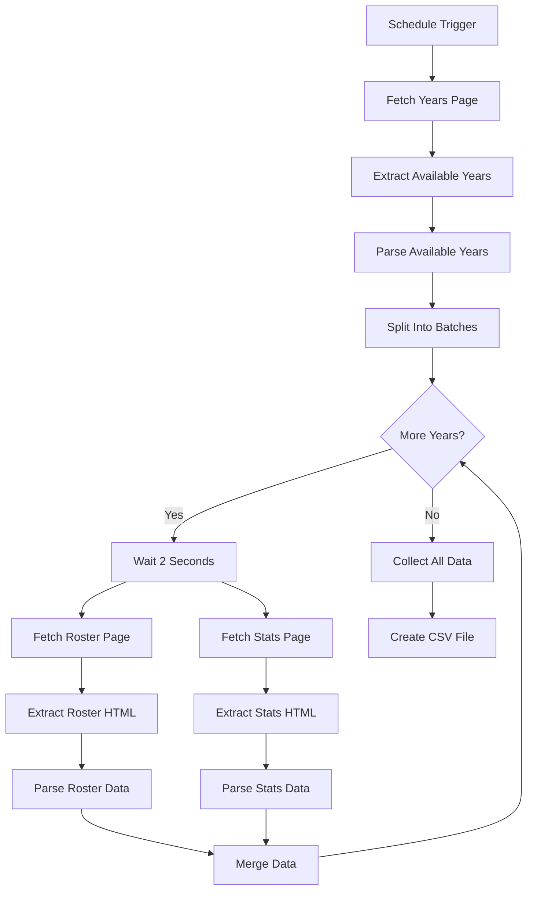

# Soccer Data Extraction Workflow

## Overview
This n8n workflow automatically extracts soccer player roster and statistics data from Harding Sports website across multiple seasons and exports the combined data as CSV. The workflow features enhanced filtering capabilities to exclude game results, team statistics, and other non-player data, ensuring accurate player-focused data extraction.

## Quick Start
1. Import `soccer.json` into your n8n instance
2. Configure the Schedule Trigger for your desired frequency
3. Activate the workflow
4. Monitor execution logs for progress

## Architecture Overview

## Data Flow
1. **Discovery**: Identifies available seasons from the main roster page
2. **Extraction**: Fetches roster and statistics pages for each season
3. **Processing**: Parses HTML content into structured data
4. **Output**: Combines all seasons into a single CSV file

## Node Documentation
- [01 - Schedule Trigger](nodes/01-schedule-trigger.md)
- [02 - Fetch Years Page](nodes/02-fetch-years-page.md)
- [03 - Extract Available Years](nodes/03-extract-available-years.md)
- [04 - Parse Available Years](nodes/04-parse-available-years.md)
- [05 - Split Into Batches](nodes/05-split-into-batches.md)
- [06 - Wait 2 Seconds](nodes/06-wait-2-seconds.md)
- [07 - Fetch Roster Page](nodes/07-fetch-roster-page.md)
- [08 - Fetch Stats Page](nodes/08-fetch-stats-page.md)
- [09 - Extract Roster HTML](nodes/09-extract-roster-html.md)
- [10 - Extract Stats HTML](nodes/10-extract-stats-html.md)
- [11 - Parse Roster Data](nodes/11-parse-roster-data.md)
- [12 - Parse Stats Data](nodes/12-parse-stats-data.md)
- [13 - Merge](nodes/13-merge.md)
- [14 - More Years?](nodes/14-more-years.md)
- [15 - Collect All Data](nodes/15-collect-all-data.md)
- [16 - Create CSV File](nodes/16-create-csv-file.md)

## Code Snippets
Reusable JavaScript functions used across multiple nodes:
- [HTML Parsers](code-snippets/html-parsers.js)
- [Data Validators](code-snippets/data-validators.js)
- [Utilities](code-snippets/utilities.js)

## Output Schema
The final CSV contains these columns:
- `section_type`: "roster" or "stats"
- `season`: Academic year (e.g., "2024-25")
- `name`: Player name
- `jersey_number`: Uniform number
- Roster fields: `position`, `height`, `weight`, `year_in_school`, `hometown`
- Stats fields: `games_played`, `games_started`, `minutes`, `goals`, `assists`, `points`, `shots`, `shot_percentage`, `shots_on_goal`, `sog_percentage`, `yellow_red_cards`, `game_winners`, `penalty_goals_attempts`

## Requirements
- n8n version: 1.0+
- Internet connectivity to hardingsports.com
- No external dependencies required

## Configuration
- Default interval: Not set (manual trigger)
- Rate limiting: 2-second delays between requests
- Error handling: Basic retry logic needed (see improvement suggestions)

## Testing
- [Test Cases](testing/test-cases.md)
- [Sample Responses](testing/sample-responses/)

## Deployment
- [Import/Export Instructions](deployment.md)