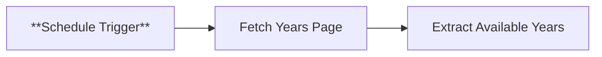

# Node 01: Schedule Trigger

## Purpose
Initiates the soccer data extraction workflow on a scheduled basis using n8n's built-in scheduling capabilities.

## Node Type
`n8n-nodes-base.scheduleTrigger` (v1.2)

## Position in Workflow


## Input Schema
```json
{
  "trigger": "schedule_based",
  "no_input_required": true
}
```
*This is a trigger node - it doesn't receive input from other nodes*

## Configuration
```json
{
  "rule": {
    "interval": [
      {}
    ]
  }
}
```

### Configuration Details
- **Trigger Type**: Interval-based scheduling
- **Interval**: Default configuration (empty object suggests manual trigger or basic interval)
- **Timezone**: Uses n8n server timezone
- **Execution**: Single execution per trigger event

## Output Schema
```json
{
  "timestamp": "2024-01-01T00:00:00.000Z",
  "timezone": "UTC",
  "trigger_source": "schedule"
}
```

## Success Criteria
- Trigger fires according to schedule
- Passes execution context to downstream nodes
- Maintains consistent timing for data collection

## Error Scenarios

### Schedule Configuration Issues
- **Cause**: Invalid interval configuration, timezone conflicts
- **Detection**: Workflow doesn't execute at expected times
- **Handling**: Currently none (workflow won't run)
- **Improvement**: Add validation and default fallback intervals

### n8n Service Interruption
- **Cause**: n8n service restart, server downtime
- **Detection**: Missing scheduled executions
- **Handling**: None (executions are missed)
- **Improvement**: Add catch-up logic for missed executions

### Execution Overlap
- **Cause**: Previous workflow execution still running when new trigger fires
- **Detection**: Multiple concurrent executions
- **Handling**: Default n8n behavior (queue or skip)
- **Improvement**: Configure execution mode explicitly

## Testing

### Manual Testing
```bash
# In n8n interface
1. Open workflow
2. Click "Test workflow" button
3. Verify trigger initiates execution
```

### Schedule Validation
```javascript
// Check if trigger is configured correctly
console.log('Trigger timestamp:', new Date().toISOString());
console.log('Execution context:', $execution.id);
```

### Debug Checklist
1. ✅ Is the schedule trigger properly configured?
2. ✅ Is the workflow active and enabled?
3. ✅ Are there any execution errors in n8n logs?
4. ✅ Is the n8n service running continuously?

## Improvements Needed
1. **Explicit Scheduling**: Configure specific interval (e.g., daily at 2 AM)
2. **Execution Mode**: Set to prevent overlapping executions
3. **Error Handling**: Add workflow-level error handling
4. **Monitoring**: Add execution success/failure notifications
5. **Documentation**: Document intended schedule frequency

## Recommended Configuration
```json
{
  "rule": {
    "interval": [
      {
        "field": "hours",
        "triggerAtHour": 2,
        "triggerAtMinute": 0
      }
    ]
  },
  "timezone": "America/Chicago"
}
```

## Dependencies
- n8n service availability
- Proper n8n scheduling configuration
- Active workflow status

## Related Nodes
- **Downstream**: [02 - Fetch Years Page](02-fetch-years-page.md)
- **Type**: Trigger node (workflow entry point)