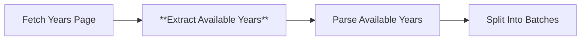

# Node 03: Extract Available Years

## Purpose
Extracts HTML elements containing season/year information from the fetched roster page using CSS selectors to identify dropdown options and navigation links.

## Node Type
`n8n-nodes-base.html` (v1.2)

## Position in Workflow


## Input Schema
```json
{
  "statusCode": 200,
  "headers": {
    "content-type": "text/html; charset=utf-8"
  },
  "body": "<html>...</html>"
}
```
*Receives HTTP response from Fetch Years Page node*

## Configuration
```json
{
  "operation": "extractHtmlContent",
  "extractionValues": {
    "values": [
      {
        "key": "yearOptions",
        "cssSelector": "select#roster_select option, select.yearselect option, .roster-season-select option, .sidearm-dropdown option",
        "returnValue": "html",
        "returnArray": true
      },
      {
        "key": "yearLinks",
        "cssSelector": "a[href*='/roster/'], .season-links a, .year-navigation a",
        "returnValue": "html",
        "returnArray": true
      }
    ]
  },
  "options": {}
}
```

### Configuration Details
- **Operation**: Extract HTML content using CSS selectors
- **Multiple Selectors**: Supports various website layouts
- **Return Format**: Raw HTML for further processing
- **Array Output**: Returns all matching elements as array

## CSS Selector Strategy

### Year Options Selectors
```css
select#roster_select option         /* Primary roster selector */
select.yearselect option           /* Alternative year selector */
.roster-season-select option       /* Season selection dropdown */
.sidearm-dropdown option           /* SideArm CMS dropdown */
```

### Year Links Selectors
```css
a[href*='/roster/']               /* Direct roster links */
.season-links a                   /* Season navigation links */
.year-navigation a                /* Year navigation menu */
```

## Output Schema
```json
{
  "yearOptions": [
    "<option value=\"2024-25\">2024-25 Season</option>",
    "<option value=\"2023-24\">2023-24 Season</option>",
    "<option value=\"2022-23\">2022-23 Season</option>"
  ],
  "yearLinks": [
    "<a href=\"/roster/2024-25\">2024-25</a>",
    "<a href=\"/roster/2023-24\">2023-24</a>"
  ]
}
```

## Success Criteria
- Extracts at least one year option or link
- Returns valid HTML fragments
- Preserves year information in extractable format

## Error Scenarios

### No Matching Elements
- **Cause**: Website layout change, different CSS classes
- **Detection**: Empty arrays in output
- **Handling**: Downstream fallback to current year
- **Improvement**: Add more comprehensive selectors

### Malformed HTML
- **Cause**: Invalid HTML structure, encoding issues
- **Detection**: Parsing errors, empty extractions
- **Handling**: Continue with empty data
- **Improvement**: Add HTML validation step

### Website Structure Changes
- **Cause**: Website redesign, CMS update
- **Detection**: Changed CSS classes, different HTML structure
- **Handling**: Selectors fail to match
- **Improvement**: Regular selector validation and updates

## Testing

### Manual Validation
```bash
# Test CSS selectors in browser console
document.querySelectorAll('select#roster_select option');
document.querySelectorAll('a[href*="/roster/"]');
```

### Expected Elements
The selectors should find elements like:
```html
<!-- Year Options -->
<select id="roster_select">
  <option value="2024-25">2024-25 Season</option>
  <option value="2023-24">2023-24 Season</option>
</select>

<!-- Year Links -->
<a href="/roster/2024-25">2024-25 Roster</a>
<a href="/roster/2023-24">2023-24 Roster</a>
```

### Debug Checklist
1. ✅ Is the input HTML valid and complete?
2. ✅ Do the CSS selectors match the actual page structure?
3. ✅ Are both yearOptions and yearLinks arrays populated?
4. ✅ Does the extracted HTML contain year information?

## Common Issues

### Empty Extractions
```javascript
// Debug empty results
if (!yearOptions.length && !yearLinks.length) {
  console.warn('No year data extracted - check selectors');
  // Log page structure for analysis
}
```

### Selector Specificity
- Start with most specific selectors
- Fall back to more generic patterns
- Consider multiple website layouts

## Improvements Needed
1. **Robust Selectors**: Add more fallback selector patterns
2. **Content Validation**: Verify extracted HTML contains years
3. **Error Reporting**: Log which selectors succeeded/failed
4. **Dynamic Selectors**: Adapt selectors based on detected website type
5. **Caching**: Cache successful selectors for faster future executions

## Selector Maintenance
```javascript
// Recommended selector testing approach
const selectorTests = [
  'select#roster_select option',
  'select.yearselect option', 
  '.roster-season-select option'
];

selectorTests.forEach(selector => {
  const matches = document.querySelectorAll(selector);
  console.log(`${selector}: ${matches.length} matches`);
});
```

## Dependencies
- Valid HTML input from upstream node
- Consistent website CSS structure
- Browser-compatible CSS selectors

## Related Nodes
- **Upstream**: [02 - Fetch Years Page](02-fetch-years-page.md)
- **Downstream**: [04 - Parse Available Years](04-parse-available-years.md)
- **Similar Pattern**: [09 - Extract Roster HTML](09-extract-roster-html.md), [10 - Extract Stats HTML](10-extract-stats-html.md)