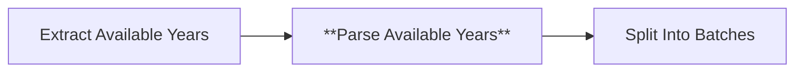
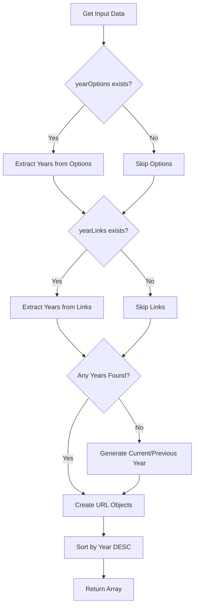

# Node 04: Parse Available Years

## Purpose
Executes JavaScript code to extract academic year patterns (e.g., "2024-25") from HTML content and generates structured data with URLs for roster and stats pages for each discovered season.

## Node Type
`n8n-nodes-base.code` (v2)

## Position in Workflow


## Input Schema
```json
{
  "yearOptions": ["<option value=\"2024-25\">2024-25</option>", "..."],
  "yearLinks": ["<a href=\"/roster/2023-24\">2023-24</a>", "..."]
}
```

## Configuration
JavaScript code that:
1. Extracts year patterns using regex
2. Creates URL structures for each season  
3. Provides fallback years if none found
4. Sorts results by year (newest first)

## Core JavaScript Code
```javascript
// Extract available years from the page
const years = new Set();
const yearOptions = $input.all()[0].json.yearOptions || [];
const yearLinks = $input.all()[0].json.yearLinks || [];

// Pattern to match year formats like 2024-25, 2023-24, etc.
const yearPattern = /20\d{2}-\d{2}/g;

// Extract from select options
yearOptions.forEach(option => {
  const matches = option.match(yearPattern);
  if (matches) {
    matches.forEach(year => years.add(year));
  }
  
  // Also check for value attribute
  const valueMatch = option.match(/value="([^"]+)"/);
  if (valueMatch) {
    const yearMatch = valueMatch[1].match(yearPattern);
    if (yearMatch) {
      years.add(yearMatch[0]);
    }
  }
});

// Extract from links
yearLinks.forEach(link => {
  const matches = link.match(yearPattern);
  if (matches) {
    matches.forEach(year => years.add(year));
  }
});

// If no years found, use current year as default
if (years.size === 0) {
  const currentYear = new Date().getFullYear();
  const yearStr = `${currentYear}-${(currentYear + 1).toString().slice(-2)}`;
  years.add(yearStr);
  // Add previous year too
  const prevYear = currentYear - 1;
  const prevYearStr = `${prevYear}-${currentYear.toString().slice(-2)}`;
  years.add(prevYearStr);
}

// Convert to array and create items for each year
const yearItems = Array.from(years).map(year => ({
  year: year,
  rosterUrl: `https://hardingsports.com/sports/mens-soccer/roster/${year}`,
  statsUrl: `https://hardingsports.com/sports/mens-soccer/stats/${year}`
}));

// Sort by year (newest first)
yearItems.sort((a, b) => b.year.localeCompare(a.year));

console.log(`Found ${yearItems.length} years to process:`, yearItems.map(y => y.year));

return yearItems;
```

## Output Schema
```json
[
  {
    "year": "2024-25",
    "rosterUrl": "https://hardingsports.com/sports/mens-soccer/roster/2024-25",
    "statsUrl": "https://hardingsports.com/sports/mens-soccer/stats/2024-25"
  },
  {
    "year": "2023-24", 
    "rosterUrl": "https://hardingsports.com/sports/mens-soccer/roster/2023-24",
    "statsUrl": "https://hardingsports.com/sports/mens-soccer/stats/2023-24"
  }
]
```

## Logic Flow


## Key Functions

### Year Pattern Matching
- **Pattern**: `/20\d{2}-\d{2}/g` matches academic years like "2024-25"
- **Sources**: Extracts from both HTML content and value attributes
- **Deduplication**: Uses `Set` to avoid duplicate years

### URL Generation
- **Template**: `https://hardingsports.com/sports/mens-soccer/{page}/{year}`
- **Pages**: `roster` and `stats`
- **Consistent**: Same pattern for all years

### Fallback Logic
- **Trigger**: When no years are discovered from HTML
- **Strategy**: Generate current and previous academic years
- **Format**: Current year to next year (e.g., 2024-25)

## Error Scenarios

### No Input Data
- **Cause**: Upstream HTML extraction failed
- **Detection**: Empty or undefined input arrays
- **Handling**: Generates fallback years
- **Impact**: May process non-existent pages

### Invalid Year Formats
- **Cause**: Website changes year format (e.g., "Fall 2024" instead of "2024-25")
- **Detection**: Regex doesn't match
- **Handling**: Falls back to generated years
- **Improvement**: Add multiple regex patterns

### Malformed HTML
- **Cause**: Corrupted or incomplete HTML responses
- **Detection**: Regex matches but extraction fails
- **Handling**: Partial extraction + fallbacks
- **Improvement**: Add HTML validation

## Testing

### Unit Test Data
```javascript
// Test input
const testInput = {
  yearOptions: [
    '<option value="2024-25">2024-25 Season</option>',
    '<option value="2023-24">2023-24 Season</option>'
  ],
  yearLinks: [
    '<a href="/roster/2022-23">2022-23</a>'
  ]
};

// Expected output
const expectedYears = ["2024-25", "2023-24", "2022-23"];
```

### Edge Cases
1. **Empty Input**: Should generate current/previous years
2. **Duplicate Years**: Should deduplicate correctly
3. **Mixed Formats**: Should handle various HTML structures
4. **Invalid Years**: Should filter out non-academic years

## Debug Checklist
1. ✅ Are input arrays properly populated?
2. ✅ Does regex pattern match expected year formats?
3. ✅ Are URLs being constructed correctly?
4. ✅ Is sorting working (newest first)?
5. ✅ Are console.log messages appearing in execution logs?

## Improvements Needed
1. **Input Validation**: Check input data structure before processing
2. **Multiple Year Patterns**: Support different year formats
3. **URL Validation**: Verify generated URLs are reachable
4. **Error Reporting**: Better error messages for debugging
5. **Configuration**: Move URL templates to configurable parameters

## Related Code Snippets
- [Year Pattern Utilities](../code-snippets/utilities.js#yearPatterns)
- [URL Builders](../code-snippets/utilities.js#urlBuilder)

## Dependencies
- No external libraries required
- Relies on JavaScript native regex and array methods

## Related Nodes
- **Upstream**: [03 - Extract Available Years](03-extract-available-years.md)
- **Downstream**: [05 - Split Into Batches](05-split-into-batches.md)