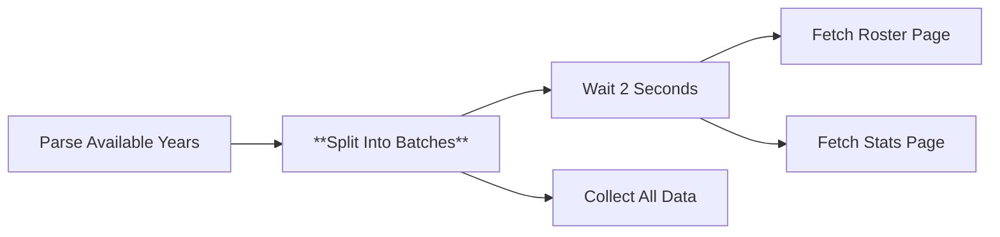
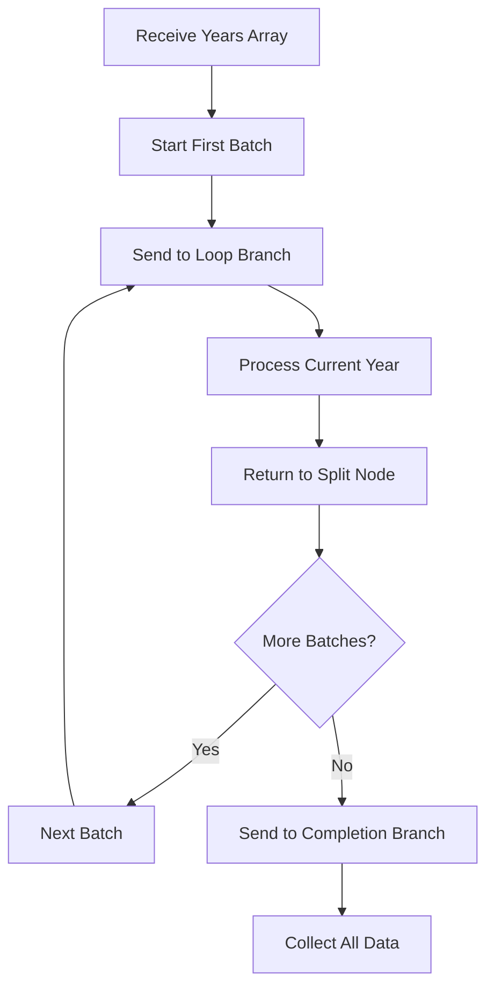

# Node 05: Split Into Batches

## Purpose
Processes the array of years sequentially, enabling the workflow to handle multiple seasons one at a time while maintaining execution context and enabling loop control.

## Node Type
`n8n-nodes-base.splitInBatches` (v3)

## Position in Workflow


## Input Schema
```json
[
  {
    "year": "2024-25",
    "rosterUrl": "https://hardingsports.com/sports/mens-soccer/roster/2024-25",
    "statsUrl": "https://hardingsports.com/sports/mens-soccer/stats/2024-25"
  },
  {
    "year": "2023-24",
    "rosterUrl": "https://hardingsports.com/sports/mens-soccer/roster/2023-24", 
    "statsUrl": "https://hardingsports.com/sports/mens-soccer/stats/2023-24"
  }
]
```

## Configuration
```json
{
  "options": {}
}
```

### Configuration Details
- **Batch Size**: Default (1 item per batch)
- **Reset**: Automatically handles iteration state
- **Context**: Maintains batch information for downstream nodes
- **Completion**: Tracks when all batches are processed

## Output Schema

### During Iteration
```json
{
  "year": "2024-25",
  "rosterUrl": "https://hardingsports.com/sports/mens-soccer/roster/2024-25",
  "statsUrl": "https://hardingsports.com/sports/mens-soccer/stats/2024-25"
}
```

### Batch Context (Available to downstream nodes)
```javascript
$('split into batches').item.json        // Current item
$('split into batches').isCompleted      // Boolean: all batches done
$('split into batches').batchIndex       // Current batch number
$('split into batches').batchSize        // Size of current batch
```

## Execution Flow


## Branch Behavior

### Loop Branch (Index 1)
- **Purpose**: Process individual years
- **Trigger**: For each year in the array
- **Data**: Single year object
- **Context**: Batch iteration information

### Completion Branch (Index 0)
- **Purpose**: Final data collection
- **Trigger**: When all batches are processed
- **Data**: Empty or summary data
- **Context**: Completion flag set to true

## Key Features

### Sequential Processing
- Processes one year at a time
- Maintains order from input array
- Prevents overwhelming target website

### Context Preservation
- Each iteration knows its position
- Downstream nodes can access batch state
- Enables conditional logic based on completion

### Loop Control
- Automatic iteration management
- No manual counter required
- Built-in completion detection

## Error Scenarios

### Empty Input Array
- **Cause**: No years found in upstream processing
- **Detection**: No iterations triggered
- **Handling**: Goes directly to completion branch
- **Impact**: No data processing occurs

### Iteration Failure
- **Cause**: Error in loop branch processing
- **Detection**: Workflow execution stops
- **Handling**: Currently none (fails completely)
- **Improvement**: Add error handling in loop branch

### Infinite Loop Risk
- **Cause**: Completion condition never met
- **Detection**: Workflow runs indefinitely
- **Handling**: n8n execution timeout
- **Improvement**: Add maximum iteration limit

## Testing

### Manual Testing
```javascript
// Test data
const testYears = [
  { year: "2024-25", rosterUrl: "...", statsUrl: "..." },
  { year: "2023-24", rosterUrl: "...", statsUrl: "..." }
];

// Expected iterations: 2
// Expected completion: true after 2nd iteration
```

### Validation Points
```javascript
// In downstream nodes, verify:
console.log('Current batch:', $('split into batches').batchIndex);
console.log('Is completed:', $('split into batches').isCompleted);
console.log('Current item:', $('split into batches').item.json);
```

### Debug Checklist
1. ✅ Is the input array properly structured?
2. ✅ Are iterations happening sequentially?
3. ✅ Is the completion branch triggered correctly?
4. ✅ Do downstream nodes have access to batch context?

## Common Patterns

### Accessing Current Item
```javascript
// In any downstream node within the loop
const currentYear = $('split into batches').item.json.year;
const rosterUrl = $('split into batches').item.json.rosterUrl;
```

### Checking Completion
```javascript
// In the conditional node
if ($('split into batches').isCompleted) {
  // All years processed - collect data
} else {
  // Continue with next year
}
```

## Improvements Needed
1. **Error Handling**: Add try-catch logic in loop processing
2. **Progress Tracking**: Log iteration progress
3. **Batch Size Configuration**: Allow configurable batch sizes
4. **Timeout Protection**: Add maximum iteration limits
5. **Performance**: Consider parallel processing for independent operations

## Performance Considerations
- **Sequential Nature**: Processes one year at a time (slower but safer)
- **Memory Usage**: Minimal - only one item in memory per iteration
- **Rate Limiting**: Natural throttling for web requests
- **Scalability**: Linear scaling with number of years

## Dependencies
- Valid input array from Parse Available Years
- Proper conditional logic in downstream branches
- Correctly configured output connections

## Related Nodes
- **Upstream**: [04 - Parse Available Years](04-parse-available-years.md)
- **Loop Branch**: [06 - Wait 2 Seconds](06-wait-2-seconds.md)
- **Completion Branch**: [15 - Collect All Data](15-collect-all-data.md)
- **Control Flow**: [14 - More Years?](14-more-years.md)