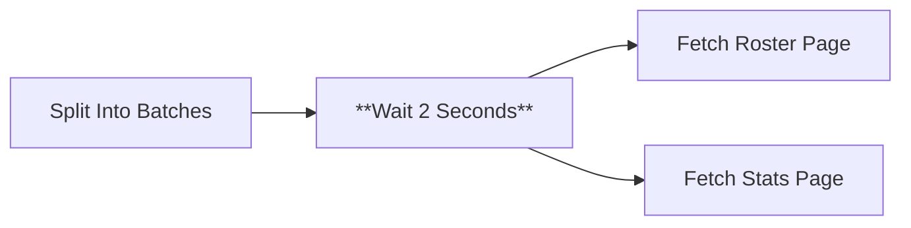

# Node 06: Wait 2 Seconds

## Purpose
Introduces a deliberate delay between iterations to avoid overwhelming the target website with rapid successive requests, implementing basic rate limiting and respectful scraping practices.

## Node Type
`n8n-nodes-base.wait` (v1.1)

## Position in Workflow


## Input Schema
```json
{
  "year": "2024-25",
  "rosterUrl": "https://hardingsports.com/sports/mens-soccer/roster/2024-25",
  "statsUrl": "https://hardingsports.com/sports/mens-soccer/stats/2024-25"
}
```
*Passes through data unchanged after delay*

## Configuration
```json
{
  "amount": 2
}
```

### Configuration Details
- **Wait Type**: Fixed duration
- **Duration**: 2 seconds
- **Unit**: Seconds (default)
- **Behavior**: Blocks execution for specified time

## Output Schema
```json
{
  "year": "2024-25",
  "rosterUrl": "https://hardingsports.com/sports/mens-soccer/roster/2024-25",
  "statsUrl": "https://hardingsports.com/sports/mens-soccer/stats/2024-25"
}
```
*Identical to input - no data transformation*

## Success Criteria
- Pauses execution for exactly 2 seconds
- Passes input data through unchanged
- Prevents rate limiting from target website

## Error Scenarios

### Excessive Delays
- **Cause**: Accumulation of wait times over many iterations
- **Detection**: Slow workflow execution
- **Handling**: None - waits are intentional
- **Impact**: Longer total execution time

### System Resource Usage
- **Cause**: Workflow holds resources during wait
- **Detection**: High memory usage, blocked execution threads
- **Handling**: n8n manages resource allocation
- **Improvement**: Consider async wait implementations

### Interrupted Execution
- **Cause**: n8n service restart during wait period
- **Detection**: Workflow execution stops mid-wait
- **Handling**: Execution fails and must be restarted
- **Improvement**: Add execution persistence

## Rate Limiting Strategy

### Current Implementation
- **Fixed Delay**: 2 seconds between iterations
- **Conservative**: Prevents most rate limiting issues
- **Simple**: No complex throttling logic

### Rationale
```javascript
// 2 seconds allows:
// - Server processing time
// - Network latency buffer
// - Respectful scraping interval
// - Time for concurrent request handling
```

## Testing

### Manual Timing Test
```bash
# Measure actual wait time
start_time=$(date +%s)
# Execute workflow step
end_time=$(date +%s)
duration=$((end_time - start_time))
echo "Wait duration: ${duration} seconds"
```

### Performance Impact
```javascript
// Calculate total wait time
const yearsToProcess = 5;
const waitTimePerYear = 2; // seconds
const totalWaitTime = yearsToProcess * waitTimePerYear;
console.log(`Total wait time: ${totalWaitTime} seconds`);
```

### Debug Checklist
1. ✅ Is the wait duration appropriate for the target website?
2. ✅ Are data values preserved through the wait?
3. ✅ Is the wait occurring at the right point in the workflow?
4. ✅ Are there any timeout issues in downstream nodes?

## Alternative Approaches

### Dynamic Wait Times
```javascript
// Could implement variable delays based on:
// - Response time of previous requests  
// - HTTP response headers (rate limit info)
// - Time of day (lower traffic periods)
// - Number of items being processed
```

### Conditional Waiting
```javascript
// Skip wait for first iteration
if ($('split into batches').batchIndex > 0) {
  // Wait only for subsequent requests
}
```

## Improvements Needed
1. **Dynamic Timing**: Adjust wait time based on server response
2. **Rate Limit Detection**: Monitor for 429 responses and adjust accordingly
3. **Configurable Duration**: Make wait time configurable parameter
4. **Smart Throttling**: Implement exponential backoff on errors
5. **Skip First Wait**: Don't wait before the first request

## Performance Optimization
```javascript
// Recommended improvements:
const config = {
  baseWaitTime: 1,        // Minimum wait (seconds)
  maxWaitTime: 10,        // Maximum wait (seconds)
  backoffMultiplier: 2,   // Exponential backoff
  skipFirstWait: true     // No wait on first iteration
};
```

## Rate Limiting Best Practices
- **Respect robots.txt**: Check website crawling policies
- **Monitor Response Headers**: Look for rate limit indicators
- **Implement Jitter**: Add randomness to avoid synchronized requests
- **Use Exponential Backoff**: Increase delays after failures
- **Cache Responses**: Avoid repeated identical requests

## Dependencies
- n8n wait mechanism functionality
- System timer accuracy
- Stable workflow execution environment

## Related Nodes
- **Upstream**: [05 - Split Into Batches](05-split-into-batches.md)
- **Downstream**: [07 - Fetch Roster Page](07-fetch-roster-page.md), [08 - Fetch Stats Page](08-fetch-stats-page.md)
- **Pattern**: Rate limiting component