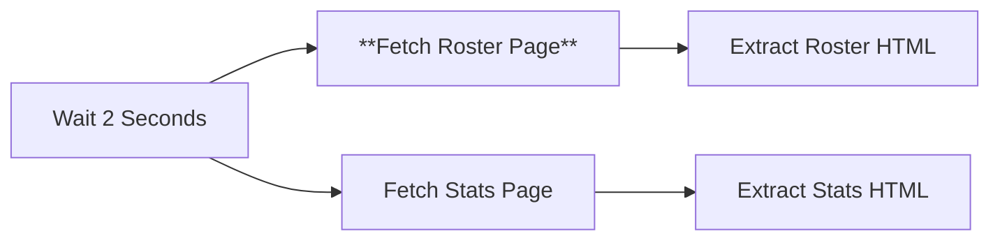

# Node 07: Fetch Roster Page

## Purpose
Makes an HTTP GET request to fetch the roster page for a specific season, retrieving HTML content containing player roster information.

## Node Type
`n8n-nodes-base.httpRequest` (v4.2)

## Position in Workflow


## Input Schema
```json
{
  "year": "2024-25",
  "rosterUrl": "https://hardingsports.com/sports/mens-soccer/roster/2024-25",
  "statsUrl": "https://hardingsports.com/sports/mens-soccer/stats/2024-25"
}
```

## Configuration
```json
{
  "url": "={{ $json.rosterUrl }}",
  "sendHeaders": true,
  "headerParameters": {
    "parameters": [
      {
        "name": "User-Agent",
        "value": "Mozilla/5.0"
      }
    ]
  },
  "options": {}
}
```

### Configuration Details
- **URL**: Dynamic, using `rosterUrl` from input data
- **Method**: GET (default)
- **Headers**: User-Agent set to avoid bot detection
- **Authentication**: None required
- **Timeout**: Default (30 seconds)

## Dynamic URL Resolution
```javascript
// URL is constructed from:
// Base: https://hardingsports.com/sports/mens-soccer/roster/
// Year: 2024-25 (from input)
// Result: https://hardingsports.com/sports/mens-soccer/roster/2024-25
```

## Output Schema
```json
{
  "statusCode": 200,
  "headers": {
    "content-type": "text/html; charset=utf-8",
    "content-length": "45678",
    "server": "nginx",
    "...": "..."
  },
  "body": "<html>...</html>"
}
```

## Success Criteria
- HTTP status code 200
- Response body contains HTML with roster table
- Content-Type is text/html
- Page contains player data elements

## Error Scenarios

### Network Errors
- **Cause**: DNS resolution failure, connection timeout, network issues
- **Detection**: HTTP client exceptions, timeout errors
- **Handling**: Currently none (workflow stops)
- **Improvement**: Add retry logic with exponential backoff

### Page Not Found (404)
- **Cause**: Invalid year format, page doesn't exist for that season
- **Detection**: HTTP status code 404
- **Handling**: Currently none (workflow continues with error)
- **Improvement**: Skip processing for invalid years

### Rate Limiting (429)
- **Cause**: Too many requests from same IP
- **Detection**: HTTP status code 429, rate limit headers
- **Handling**: None (could cascade failures)
- **Improvement**: Implement exponential backoff

### Website Changes
- **Cause**: URL structure change, page moved permanently
- **Detection**: 301/302 redirects, 404 responses
- **Handling**: Currently none
- **Improvement**: Handle redirects, validate URL patterns

### Server Errors (5xx)
- **Cause**: Target server issues, maintenance mode
- **Detection**: HTTP status codes 500-599
- **Handling**: None (workflow fails)
- **Improvement**: Add retry logic for temporary server issues

## Testing

### Manual Testing
```bash
# Test roster URL directly
curl -H "User-Agent: Mozilla/5.0" \
  "https://hardingsports.com/sports/mens-soccer/roster/2024-25"
```

### URL Validation
```javascript
// Test URL construction
const testData = {
  rosterUrl: "https://hardingsports.com/sports/mens-soccer/roster/2024-25"
};
console.log('Testing URL:', testData.rosterUrl);
```

### Expected Response Validation
The response should contain elements like:
```html
<table class="roster-table">
  <tbody>
    <tr>
      <td>1</td>
      <td><a href="/player/...">John Doe</a></td>
      <td>GK</td>
      <td>6'2"</td>
      <td>185</td>
    </tr>
  </tbody>
</table>
```

### Debug Checklist
1. ✅ Is the rosterUrl properly formatted?
2. ✅ Is the target website accessible?
3. ✅ Does the page exist for the specified year?
4. ✅ Is the User-Agent header being sent?
5. ✅ Are there any rate limiting responses?

## Common Issues

### Invalid Year Formats
```javascript
// Handle various year formats
const validYearFormats = [
  "2024-25",    // Standard format
  "2024-2025",  // Full year format
  "2024"        // Single year format
];
```

### Empty Responses
```javascript
// Check for valid roster content
if (response.body.length < 1000) {
  console.warn('Roster page may be empty or invalid');
}
```

## Improvements Needed
1. **Response Validation**: Check for 200 status code and valid content
2. **Retry Logic**: 3 attempts with exponential backoff (2s, 4s, 8s)
3. **Error Handling**: Graceful handling of 404s and rate limits
4. **Content Validation**: Verify HTML contains expected roster elements
5. **Logging**: Log request details and response metadata
6. **Timeout Configuration**: Explicit timeout settings

## Enhanced Configuration
```json
{
  "url": "={{ $json.rosterUrl }}",
  "method": "GET",
  "sendHeaders": true,
  "headerParameters": {
    "parameters": [
      {
        "name": "User-Agent",
        "value": "Mozilla/5.0 (compatible; n8n-workflow)"
      },
      {
        "name": "Accept",
        "value": "text/html,application/xhtml+xml"
      }
    ]
  },
  "options": {
    "timeout": 30000,
    "followRedirect": true,
    "ignoreHttpStatusCode": false
  }
}
```

## Dependencies
- Internet connectivity
- hardingsports.com availability
- Valid roster URLs from upstream processing
- No rate limiting from target site

## Related Nodes
- **Upstream**: [06 - Wait 2 Seconds](06-wait-2-seconds.md)
- **Downstream**: [09 - Extract Roster HTML](09-extract-roster-html.md)
- **Parallel**: [08 - Fetch Stats Page](08-fetch-stats-page.md)
- **Similar Pattern**: [02 - Fetch Years Page](02-fetch-years-page.md)