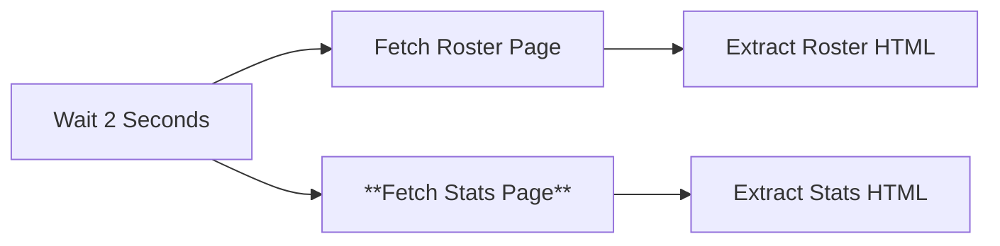

# Node 08: Fetch Stats Page

## Purpose
Makes an HTTP GET request to fetch the statistics page for a specific season, retrieving HTML content containing player performance statistics.

## Node Type
`n8n-nodes-base.httpRequest` (v4.2)

## Position in Workflow


## Input Schema
```json
{
  "year": "2024-25",
  "rosterUrl": "https://hardingsports.com/sports/mens-soccer/roster/2024-25",
  "statsUrl": "https://hardingsports.com/sports/mens-soccer/stats/2024-25"
}
```

## Configuration
```json
{
  "url": "={{ $json.statsUrl }}",
  "sendHeaders": true,
  "headerParameters": {
    "parameters": [
      {
        "name": "User-Agent",
        "value": "Mozilla/5.0"
      }
    ]
  },
  "options": {}
}
```

### Configuration Details
- **URL**: Dynamic, using `statsUrl` from input data
- **Method**: GET (default)
- **Headers**: User-Agent set to avoid bot detection
- **Authentication**: None required
- **Timeout**: Default (30 seconds)

## Dynamic URL Resolution
```javascript
// URL is constructed from:
// Base: https://hardingsports.com/sports/mens-soccer/stats/
// Year: 2024-25 (from input)
// Result: https://hardingsports.com/sports/mens-soccer/stats/2024-25
```

## Output Schema
```json
{
  "statusCode": 200,
  "headers": {
    "content-type": "text/html; charset=utf-8",
    "content-length": "52341",
    "server": "nginx",
    "...": "..."
  },
  "body": "<html>...</html>"
}
```

## Success Criteria
- HTTP status code 200
- Response body contains HTML with statistics table
- Content-Type is text/html
- Page contains player statistics data

## Error Scenarios

### Network Errors
- **Cause**: DNS resolution failure, connection timeout, network issues
- **Detection**: HTTP client exceptions, timeout errors
- **Handling**: Currently none (workflow stops)
- **Improvement**: Add retry logic with exponential backoff

### Page Not Found (404)
- **Cause**: Stats page doesn't exist for that season, URL structure change
- **Detection**: HTTP status code 404
- **Handling**: Currently none (workflow continues with error)
- **Improvement**: Skip stats processing for unavailable years

### Rate Limiting (429)
- **Cause**: Multiple concurrent requests from same IP
- **Detection**: HTTP status code 429, rate limit headers
- **Handling**: None (could cascade failures)
- **Improvement**: Coordinate with roster page requests for rate limiting

### Empty Statistics
- **Cause**: Season not completed, no games played yet
- **Detection**: Empty table body, no player rows
- **Handling**: Extract empty data structure
- **Improvement**: Detect and handle pre-season scenarios

### Different Table Structure
- **Cause**: Statistics format varies by season or sport configuration
- **Detection**: Extraction failures in downstream nodes
- **Handling**: Partial data extraction
- **Improvement**: Adaptive parsing based on detected table structure

## Testing

### Manual Testing
```bash
# Test stats URL directly
curl -H "User-Agent: Mozilla/5.0" \
  "https://hardingsports.com/sports/mens-soccer/stats/2024-25"
```

### URL Validation
```javascript
// Test URL construction
const testData = {
  statsUrl: "https://hardingsports.com/sports/mens-soccer/stats/2024-25"
};
console.log('Testing stats URL:', testData.statsUrl);
```

### Expected Response Validation
The response should contain elements like:
```html
<table class="stats-table">
  <thead>
    <tr>
      <th>Player</th>
      <th>GP</th>
      <th>GS</th>
      <th>G</th>
      <th>A</th>
      <th>PTS</th>
    </tr>
  </thead>
  <tbody>
    <tr>
      <td><a href="/player/...">John Doe</a></td>
      <td>12</td>
      <td>10</td>
      <td>5</td>
      <td>3</td>
      <td>13</td>
    </tr>
  </tbody>
</table>
```

### Debug Checklist
1. ✅ Is the statsUrl properly formatted?
2. ✅ Is the target website accessible?
3. ✅ Does the stats page exist for the specified year?
4. ✅ Is the User-Agent header being sent?
5. ✅ Are there any concurrent request issues?

## Statistics Page Variations

### Common Statistics Columns
```javascript
// Typical soccer statistics found:
const expectedStats = {
  GP: "Games Played",
  GS: "Games Started", 
  G: "Goals",
  A: "Assists",
  PTS: "Points",
  SH: "Shots",
  SOG: "Shots on Goal",
  SAVE: "Saves",
  GA: "Goals Against"
};
```

### Seasonal Variations
- **Pre-season**: Limited or no statistics
- **Mid-season**: Partial statistics
- **Post-season**: Complete statistics
- **Historical**: May have different column formats

## Improvements Needed
1. **Response Validation**: Check for 200 status code and valid content
2. **Concurrent Request Management**: Coordinate with roster page fetching
3. **Error Handling**: Graceful handling of missing stats pages
4. **Content Validation**: Verify HTML contains expected statistics elements
5. **Season Detection**: Identify pre-season vs active season scenarios
6. **Retry Logic**: Implement retry with backoff for temporary failures

## Enhanced Configuration
```json
{
  "url": "={{ $json.statsUrl }}",
  "method": "GET",
  "sendHeaders": true,
  "headerParameters": {
    "parameters": [
      {
        "name": "User-Agent",
        "value": "Mozilla/5.0 (compatible; n8n-workflow)"
      },
      {
        "name": "Accept",
        "value": "text/html,application/xhtml+xml"
      },
      {
        "name": "Cache-Control",
        "value": "no-cache"
      }
    ]
  },
  "options": {
    "timeout": 30000,
    "followRedirect": true,
    "ignoreHttpStatusCode": false
  }
}
```

## Performance Considerations
- **Parallel Execution**: Runs simultaneously with roster page fetch
- **Shared Rate Limits**: May contribute to rate limiting issues
- **Response Size**: Statistics pages may be larger than roster pages
- **Caching**: Target site may cache statistics pages differently

## Dependencies
- Internet connectivity
- hardingsports.com availability
- Valid statistics URLs from upstream processing
- Coordination with parallel roster page requests

## Related Nodes
- **Upstream**: [06 - Wait 2 Seconds](06-wait-2-seconds.md) 
- **Downstream**: [10 - Extract Stats HTML](10-extract-stats-html.md)
- **Parallel**: [07 - Fetch Roster Page](07-fetch-roster-page.md)
- **Similar Pattern**: [02 - Fetch Years Page](02-fetch-years-page.md)