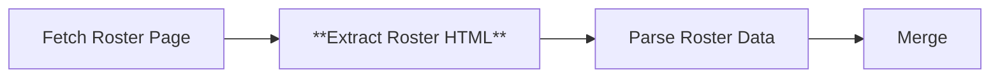

# Node 09: Extract Roster HTML

## Purpose
Extracts HTML elements containing player roster information from the fetched roster page using CSS selectors to identify table rows and player cards.

## Node Type
`n8n-nodes-base.html` (v1.2)

## Position in Workflow


## Input Schema
```json
{
  "statusCode": 200,
  "headers": {
    "content-type": "text/html; charset=utf-8"
  },
  "body": "<html>...</html>"
}
```
*Receives HTTP response from Fetch Roster Page node*

## Configuration
```json
{
  "operation": "extractHtmlContent",
  "extractionValues": {
    "values": [
      {
        "key": "rosterData",
        "cssSelector": "tbody tr, .roster-card, .s-person-card",
        "returnValue": "html",
        "returnArray": true
      }
    ]
  },
  "options": {}
}
```

### Configuration Details
- **Operation**: Extract HTML content using CSS selectors
- **Multiple Selectors**: Supports various roster layouts
- **Return Format**: Raw HTML for further processing
- **Array Output**: Returns all matching elements as array

## CSS Selector Strategy

### Primary Selectors
```css
tbody tr                /* Table rows (most common) */
.roster-card           /* Card-based layout */
.s-person-card         /* SideArm CMS person cards */
```

### Selector Rationale
- **`tbody tr`**: Standard HTML table rows containing player data
- **`.roster-card`**: Modern card-based roster displays
- **`.s-person-card`**: SideArm CMS specific card components

## Output Schema
```json
{
  "rosterData": [
    "<tr><td>1</td><td><a href=\"/player/john-doe\">John Doe</a></td><td>GK</td><td>6'2\"</td><td>185</td><td>Sr</td><td>Chicago, IL</td></tr>",
    "<tr><td>2</td><td><a href=\"/player/jane-smith\">Jane Smith</a></td><td>DEF</td><td>5'8\"</td><td>150</td><td>Jr</td><td>Austin, TX</td></tr>",
    "..."
  ]
}
```

## Expected HTML Structures

### Table-Based Roster
```html
<table class="roster-table">
  <tbody>
    <tr>
      <td class="roster_jerseynum">1</td>
      <td><a href="/player/john-doe">John Doe</a></td>
      <td>GK</td>
      <td class="height">6'2"</td>
      <td class="weight">185</td>
      <td class="class">Sr</td>
      <td class="hometown">Chicago, IL</td>
    </tr>
  </tbody>
</table>
```

### Card-Based Roster
```html
<div class="roster-card">
  <div class="jersey-number">1</div>
  <div class="player-name">John Doe</div>
  <div class="position">GK</div>
  <div class="player-details">6'2", 185 lbs, Sr, Chicago, IL</div>
</div>
```

## Success Criteria
- Extracts at least one roster element
- Returns valid HTML fragments containing player data
- Preserves player information in parseable format

## Error Scenarios

### No Matching Elements
- **Cause**: Website layout change, different CSS classes, empty roster
- **Detection**: Empty rosterData array
- **Handling**: Downstream parsing handles empty data
- **Improvement**: Add more comprehensive selectors

### Malformed HTML Structure
- **Cause**: Invalid HTML, encoding issues, partial page load
- **Detection**: Parsing errors, incomplete extractions
- **Handling**: Continue with whatever data was extracted
- **Improvement**: Add HTML validation and repair

### Template Rows
- **Cause**: HTML templates, JavaScript-rendered content, placeholder rows
- **Detection**: Rows containing template syntax or empty data
- **Handling**: Downstream parsing filters template rows
- **Improvement**: Pre-filter template content

### Missing Player Data
- **Cause**: Roster not published, off-season period, privacy restrictions
- **Detection**: Table structure exists but no player rows
- **Handling**: Returns empty data structure
- **Improvement**: Detect and report roster availability status

## Testing

### Manual Validation
```bash
# Test CSS selectors in browser console
document.querySelectorAll('tbody tr');
document.querySelectorAll('.roster-card');
document.querySelectorAll('.s-person-card');
```

### Selector Testing
```javascript
// Test all selectors
const selectors = ['tbody tr', '.roster-card', '.s-person-card'];
selectors.forEach(selector => {
  const matches = document.querySelectorAll(selector);
  console.log(`${selector}: ${matches.length} matches`);
});
```

### Debug Checklist
1. ✅ Is the input HTML valid and complete?
2. ✅ Do the CSS selectors match the actual roster structure?  
3. ✅ Is the rosterData array populated with player rows?
4. ✅ Does the extracted HTML contain parseable player information?

## Common Issues

### JavaScript-Rendered Content
```javascript
// If roster is loaded via JavaScript:
// - May need to wait for content loading
// - Static extraction might miss dynamic content
// - Consider headless browser extraction
```

### Mixed Content Types
```javascript
// Handle different row types
const validRows = rosterData.filter(row => {
  // Skip header rows, template rows, coaching staff
  return !row.includes('Coach') && 
         !row.includes('<!-- ko') &&
         row.includes('<td');
});
```

## Improvements Needed
1. **Robust Selectors**: Add more fallback selector patterns
2. **Content Validation**: Verify extracted HTML contains player data
3. **Template Filtering**: Pre-filter template and non-player rows
4. **Dynamic Content**: Handle JavaScript-rendered rosters
5. **Error Reporting**: Log which selectors succeeded/failed

## Enhanced Selector Strategy
```json
{
  "extractionValues": {
    "values": [
      {
        "key": "rosterData",
        "cssSelector": "tbody tr:not(.template):not(.header), .roster-card:not(.template), .s-person-card, .player-row, [data-player-id]",
        "returnValue": "html",
        "returnArray": true
      },
      {
        "key": "rosterHeaders",
        "cssSelector": "thead tr, .roster-headers",
        "returnValue": "html",
        "returnArray": true
      }
    ]
  }
}
```

## Data Quality Checks
```javascript
// Validate extracted roster data
const qualityChecks = {
  hasPlayerRows: rosterData.length > 0,
  hasPlayerNames: rosterData.some(row => row.includes('<a') || row.match(/[A-Z][a-z]+ [A-Z][a-z]+/)),
  hasJerseyNumbers: rosterData.some(row => row.match(/>\d+</)),
  hasPositions: rosterData.some(row => row.match(/>(GK|DEF|MID|FWD)/))
};
```

## Dependencies
- Valid HTML input from Fetch Roster Page
- Consistent website roster structure
- Browser-compatible CSS selectors

## Related Nodes
- **Upstream**: [07 - Fetch Roster Page](07-fetch-roster-page.md)
- **Downstream**: [11 - Parse Roster Data](11-parse-roster-data.md)  
- **Parallel**: [10 - Extract Stats HTML](10-extract-stats-html.md)
- **Similar Pattern**: [03 - Extract Available Years](03-extract-available-years.md)