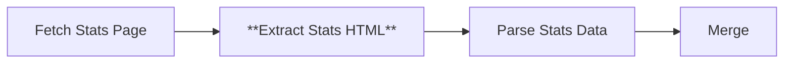

# Node 10: Extract Stats HTML

## Purpose
Extracts HTML elements containing player statistics information from the fetched statistics page using CSS selectors to identify table rows and complete table structures.

## Node Type
`n8n-nodes-base.html` (v1.2)

## Position in Workflow


## Input Schema
```json
{
  "statusCode": 200,
  "headers": {
    "content-type": "text/html; charset=utf-8"
  },
  "body": "<html>...</html>"
}
```
*Receives HTTP response from Fetch Stats Page node*

## Configuration
```json
{
  "operation": "extractHtmlContent",
  "extractionValues": {
    "values": [
      {
        "key": "playerRows",
        "cssSelector": "tbody tr",
        "returnValue": "html",
        "returnArray": true
      },
      {
        "key": "fullTable",
        "cssSelector": "table",
        "returnValue": "html",
        "returnArray": true
      }
    ]
  },
  "options": {}
}
```

### Configuration Details
- **Operation**: Extract HTML content using enhanced CSS selectors
- **Multiple Fallback Selectors**: Uses hierarchical selector approach for better data capture
- **Return Format**: Raw HTML for further processing
- **Array Output**: Returns all matching elements as arrays

## CSS Selector Strategy

### Primary Extractions (Enhanced)
```css
.sidearm-table tbody tr         /* Sidearm system statistics rows */
table[id*="player"] tbody tr    /* Player-specific tables */
table[id*="individual"] tbody tr /* Individual statistics tables */
.statistics-table tbody tr      /* Generic statistics tables */
tbody tr                        /* Fallback for any table rows */
```

### Selector Rationale
- **`.sidearm-table tbody tr`**: Primary selector for Sidearm sports management system
- **`table[id*="player"] tbody tr`**: Targets tables with 'player' in the ID
- **`table[id*="individual"] tbody tr`**: Targets individual player statistics tables
- **`.statistics-table tbody tr`**: Generic statistics table class
- **`tbody tr`**: Fallback selector for any table body rows
- **Hierarchical approach**: Multiple selectors for improved data capture across different table formats

## Output Schema
```json
{
  "playerRows": [
    "<tr><td><a href=\"/player/john-doe\">John Doe</a></td><td>1</td><td>12</td><td>10</td><td>5</td><td>3</td><td>13</td><td>25</td><td>15</td></tr>",
    "<tr><td><a href=\"/player/jane-smith\">Jane Smith</a></td><td>2</td><td>11</td><td>8</td><td>2</td><td>4</td><td>8</td><td>18</td><td>12</td></tr>",
    "..."
  ],
  "fullTable": [
    "<table class=\"stats-table\"><thead><tr><th>Player</th><th>No.</th><th>GP</th><th>GS</th><th>G</th><th>A</th><th>PTS</th><th>SH</th><th>SOG</th></tr></thead><tbody>...</tbody></table>"
  ]
}
```

## Expected HTML Structures

### Statistics Table
```html
<table class="stats-table">
  <thead>
    <tr>
      <th>Player</th>
      <th>No.</th>
      <th>GP</th>
      <th>GS</th>
      <th>G</th>
      <th>A</th>
      <th>PTS</th>
      <th>SH</th>
      <th>SOG</th>
    </tr>
  </thead>
  <tbody>
    <tr>
      <td><a href="/player/john-doe">John Doe</a></td>
      <td>1</td>
      <td>12</td>
      <td>10</td>
      <td>5</td>
      <td>3</td>
      <td>13</td>
      <td>25</td>
      <td>15</td>
    </tr>
  </tbody>
</table>
```

### Statistics Columns (Enhanced Format)
```javascript
// Enhanced individual player statistics columns:
const statColumns = {
  '#': "Jersey number",
  Player: "Player name",
  GP: "Games played",
  GS: "Games started", 
  MIN: "Minutes played",
  G: "Goals",
  A: "Assists",
  PTS: "Points",
  SH: "Shots",
  'SH%': "Shot percentage",
  SOG: "Shots on goal",
  'SOG%': "Shots on goal percentage",
  'YC-RC': "Yellow cards - Red cards",
  GW: "Game winners",
  'PG-PA': "Penalty goals - Penalty attempts"
};
```

## Success Criteria
- Extracts at least one player statistics row
- Returns valid HTML fragments containing statistical data
- Preserves numerical statistics in parseable format
- Captures complete table structure for context

## Error Scenarios

### No Statistics Available
- **Cause**: Pre-season period, no games played, statistics not published
- **Detection**: Empty playerRows array
- **Handling**: Downstream parsing handles empty data
- **Improvement**: Detect and report statistics availability status

### Different Table Structures
- **Cause**: Varying statistics formats by season or sport configuration
- **Detection**: Parsing errors in downstream nodes
- **Handling**: Partial data extraction with available columns
- **Improvement**: Adaptive parsing based on detected table headers

### Header Row Inclusion
- **Cause**: CSS selector captures header rows as data rows
- **Detection**: Rows containing column names instead of player data
- **Handling**: Downstream parsing filters header rows
- **Improvement**: More specific selectors to exclude headers

### JavaScript-Rendered Tables
- **Cause**: Statistics loaded dynamically via JavaScript
- **Detection**: Empty extraction despite visible data in browser
- **Handling**: Static extraction misses dynamic content
- **Improvement**: Consider headless browser extraction

### Mixed Content Types
- **Cause**: Total rows, summary rows, or coaching staff included
- **Detection**: Rows with unexpected data formats
- **Handling**: Downstream parsing filters non-player rows
- **Improvement**: Pre-filter non-player content

## Testing

### Manual Validation
```bash
# Test CSS selectors in browser console
document.querySelectorAll('tbody tr');
document.querySelectorAll('table');
```

### Data Quality Checks
```javascript
// Validate extracted statistics data
const qualityChecks = {
  hasPlayerRows: playerRows.length > 0,
  hasTableStructure: fullTable.length > 0,
  hasPlayerNames: playerRows.some(row => row.includes('<a') || row.match(/[A-Z][a-z]+ [A-Z][a-z]+/)),
  hasNumericStats: playerRows.some(row => row.match(/>\d+</g)),
  hasHeaderInfo: fullTable.some(table => table.includes('<th>'))
};
```

### Debug Checklist
1. ✅ Is the input HTML valid and complete?
2. ✅ Do the CSS selectors match the actual statistics table?
3. ✅ Are both playerRows and fullTable arrays populated?
4. ✅ Does the extracted HTML contain parseable statistical data?

## Common Issues

### Empty Statistics Tables
```javascript
// Handle pre-season or incomplete data
if (playerRows.length === 0) {
  console.log('No statistics available for this season');
  // Return structure indicating no data available
}
```

### Inconsistent Table Formats
```javascript
// Different seasons may have different column structures
const adaptiveColumnMapping = {
  'GP': ['GP', 'Games', 'G-P'],
  'G': ['G', 'Goals', 'GL'],
  'A': ['A', 'Assists', 'AST']
};
```

## Improvements Needed
1. **Header Detection**: Separate header extraction for column mapping
2. **Content Validation**: Verify extracted HTML contains valid statistics
3. **Dynamic Content**: Handle JavaScript-rendered statistics tables
4. **Column Mapping**: Adaptive parsing for different table structures
5. **Data Type Validation**: Ensure numeric statistics are properly extracted

## Enhanced Selector Strategy
```json
{
  "extractionValues": {
    "values": [
      {
        "key": "playerRows",
        "cssSelector": "tbody tr:not(.header):not(.total):not(.summary)",
        "returnValue": "html",
        "returnArray": true
      },
      {
        "key": "fullTable", 
        "cssSelector": "table.stats-table, table[class*='stats'], .statistics-table table",
        "returnValue": "html",
        "returnArray": true
      },
      {
        "key": "tableHeaders",
        "cssSelector": "thead tr th, .stats-header th",
        "returnValue": "text",
        "returnArray": true
      }
    ]
  }
}
```

## Statistics Data Validation
```javascript
// Validate numerical statistics
const validateStats = (row) => {
  const cells = row.match(/<td[^>]*>(.*?)<\/td>/g) || [];
  const hasNumericData = cells.slice(2).some(cell => {
    const content = cell.replace(/<[^>]*>/g, '').trim();
    return !isNaN(content) && content !== '';
  });
  return hasNumericData;
};
```

## Dependencies
- Valid HTML input from Fetch Stats Page
- Consistent website statistics table structure
- Browser-compatible CSS selectors

## Related Nodes
- **Upstream**: [08 - Fetch Stats Page](08-fetch-stats-page.md)
- **Downstream**: [12 - Parse Stats Data](12-parse-stats-data.md)
- **Parallel**: [09 - Extract Roster HTML](09-extract-roster-html.md)
- **Similar Pattern**: [03 - Extract Available Years](03-extract-available-years.md)