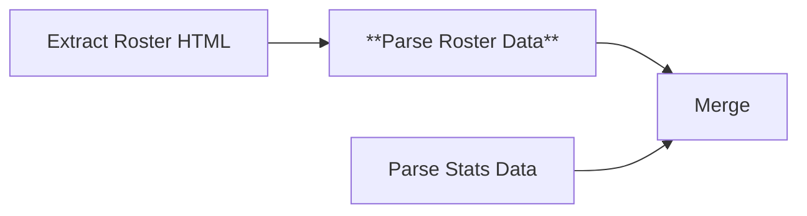

# Node 11: Parse Roster Data

## Purpose
Executes JavaScript code to parse extracted HTML roster elements, extracting structured player information including names, positions, physical attributes, and biographical details.

## Node Type
`n8n-nodes-base.code` (v2)

## Position in Workflow


## Input Schema
```json
{
  "rosterData": [
    "<tr><td>1</td><td><a href=\"/player/john-doe\">John Doe</a></td><td>GK</td><td>6'2\"</td><td>185</td><td>Sr</td><td>Chicago, IL</td></tr>",
    "..."
  ]
}
```

## Configuration
JavaScript code that:
1. Filters out template and non-player rows
2. Extracts player information using regex patterns
3. Structures data for CSV output
4. Handles various HTML formats and edge cases

## Core JavaScript Logic

### Input Processing
```javascript
const input = $input.all()[0].json;
const rosterData = input.rosterData || [];
const year = $('split into batches').item.json.year;

console.log(`Processing roster for year: ${year}`);
console.log(`Received ${Array.isArray(rosterData) ? rosterData.length : 0} roster items`);
```

### Row Filtering
```javascript
// Skip template rows and coach rows
if (!item || item.includes('<!-- ko foreach') || 
    item.includes('Coach') || item.includes('Assistant')) {
  return;
}

// Check if this row contains player data
if (item.includes('roster_jerseynum') || item.includes('td')) {
  // Process the row
}
```

### Data Extraction Patterns

#### Jersey Number
```javascript
const jerseyMatch = item.match(/>(\d+)</);
if (jerseyMatch) {
  player.jersey_number = jerseyMatch[1];
}
```

#### Player Name
```javascript
const nameMatch = item.match(/<a[^>]*>([^<]+)<\/a>/) || 
                  item.match(/>([A-Z][a-z]+ [A-Z][a-z]+)</);
if (nameMatch) {
  player.name = nameMatch[1].trim();
}
```

#### Position
```javascript
const posMatch = item.match(/(?:position|pos)[^>]*>([^<]+)</i) || 
                 item.match(/\b(GK|DEF|MID|FWD|F|M|D|G)\b/);
if (posMatch) {
  player.position = posMatch[1].trim();
}
```

#### Physical Attributes
```javascript
// Height extraction
const heightMatch = item.match(/height[^>]*data-sort="\d+">([^<]+)</) || 
                    item.match(/(\d+'\d+")/) || 
                    item.match(/(\d+\.\d+)/);

// Weight extraction
const weightMatch = item.match(/weight[^>]*>(\d+)</) || 
                    item.match(/(\d+)\s*lbs?/);
```

#### Academic Information
```javascript
// Year in school
const yearMatch = item.match(/class[^>]*>([^<]+)</) || 
                  item.match(/\b(Fr|So|Jr|Sr|Freshman|Sophomore|Junior|Senior)\b/i);

// Hometown
const hometownMatch = item.match(/hometown[^>]*>([^<]+)</) || 
                      item.match(/([A-Z][a-z]+,\s*[A-Z]{2})/);
```

## Output Schema
```json
[
  {
    "section_type": "roster",
    "season": "2024-25",
    "jersey_number": "1",
    "name": "John Doe",
    "position": "GK",
    "height": "6'2\"",
    "weight": "185",
    "year_in_school": "Sr",
    "hometown": "Chicago, IL"
  },
  "..."
]
```

## Data Structure
```javascript
const player = {
  section_type: 'roster',
  season: year,
  jersey_number: '',
  name: '',
  position: '',
  height: '',
  weight: '',
  year_in_school: '',
  hometown: ''
};
```

## Success Criteria
- Extracts at least one valid player record
- Preserves all available player information
- Maintains data consistency across seasons
- Filters out non-player entries effectively

## Error Scenarios

### Empty Roster Data
- **Cause**: Upstream HTML extraction failed, empty roster page
- **Detection**: Empty or undefined rosterData array
- **Handling**: Returns debug information with empty player list
- **Improvement**: Add upstream data validation

### Template Row Interference
- **Cause**: JavaScript templates, placeholder content in HTML
- **Detection**: Rows containing template syntax (`<!-- ko foreach`)
- **Handling**: Filtered out during processing
- **Improvement**: More comprehensive template detection

### Inconsistent HTML Structure
- **Cause**: Website updates, different roster layouts by season
- **Detection**: Regex patterns fail to match expected elements
- **Handling**: Partial data extraction, empty fields for unmatched data
- **Improvement**: Adaptive parsing based on detected structure

### Name Extraction Failures
- **Cause**: Names wrapped in different HTML structures, special characters
- **Detection**: Empty or invalid name field
- **Handling**: Player record rejected if no valid name found
- **Improvement**: More robust name extraction patterns

## Testing

### Test Data Examples
```javascript
// Valid roster row
const validRow = '<tr><td>1</td><td><a href="/player/john-doe">John Doe</a></td><td>GK</td><td>6\'2"</td><td>185</td><td>Sr</td><td>Chicago, IL</td></tr>';

// Template row (should be filtered)
const templateRow = '<!-- ko foreach: players --><tr><td data-bind="text: number"></td></tr><!-- /ko -->';

// Coach row (should be filtered)
const coachRow = '<tr><td colspan="7">Head Coach: Jane Smith</td></tr>';
```

### Validation Checks
```javascript
// Validate extracted player data
const validatePlayer = (player) => {
  return {
    hasName: player.name && player.name.length > 2,
    hasValidJersey: !isNaN(player.jersey_number) && player.jersey_number > 0,
    hasPosition: player.position && player.position.length > 0,
    hasHeight: player.height && (player.height.includes("'") || player.height.includes(".")),
    hasWeight: player.weight && !isNaN(player.weight)
  };
};
```

### Debug Checklist
1. ✅ Is the input rosterData array properly populated?
2. ✅ Are template and coach rows being filtered correctly?
3. ✅ Are regex patterns matching the expected HTML structure?
4. ✅ Is the current year context being accessed correctly?
5. ✅ Are players with valid names being extracted?

## Common Issues

### Special Characters in Names
```javascript
// Handle accented characters and apostrophes
const nameMatch = item.match(/<a[^>]*>([^<]+)<\/a>/) || 
                  item.match(/>([A-Z][a-zA-Z'\-\s]+)</);
```

### Multiple Position Formats
```javascript
// Handle various position abbreviations
const positionMap = {
  'G': 'GK', 'GK': 'GK', 'Goalkeeper': 'GK',
  'D': 'DEF', 'DEF': 'DEF', 'Defender': 'DEF',
  'M': 'MID', 'MID': 'MID', 'Midfielder': 'MID',
  'F': 'FWD', 'FWD': 'FWD', 'Forward': 'FWD'
};
```

### Height Format Variations
```javascript
// Handle different height formats
const normalizeHeight = (height) => {
  if (height.includes("'")) return height; // 6'2"
  if (height.includes(".")) {
    // Convert 6.2 to 6'2"
    const [feet, inches] = height.split(".");
    return `${feet}'${inches}"`;
  }
  return height;
};
```

## Improvements Needed
1. **Robust Pattern Matching**: More comprehensive regex patterns for edge cases
2. **Data Validation**: Validate extracted data before creating player records
3. **Adaptive Parsing**: Detect and adapt to different HTML structures
4. **Error Reporting**: Better logging for debugging parsing failures
5. **Name Standardization**: Consistent name formatting and validation

## Enhanced Parsing Logic
```javascript
// Improved player validation
const isValidPlayer = (player) => {
  const validName = player.name && 
                   player.name.length >= 2 && 
                   /[A-Za-z]/.test(player.name) &&
                   !['total', 'coach', 'staff'].some(word => 
                     player.name.toLowerCase().includes(word));
  
  return validName;
};

// Better error handling
try {
  // Parsing logic here
} catch (error) {
  console.error(`Error parsing roster row ${index}:`, error);
  return null; // Skip invalid rows
}
```

## Data Quality Assurance
```javascript
// Quality checks for extracted data
const qualityReport = {
  totalRows: rosterData.length,
  validPlayers: players.length,
  playersWithJerseyNumbers: players.filter(p => p.jersey_number).length,
  playersWithPositions: players.filter(p => p.position).length,
  playersWithHeights: players.filter(p => p.height).length,
  playersWithHometowns: players.filter(p => p.hometown).length
};

console.log('Roster parsing quality report:', qualityReport);
```

## Dependencies
- Valid HTML input from Extract Roster HTML
- Consistent access to batch context for year information
- Regex support in n8n JavaScript environment

## Related Nodes
- **Upstream**: [09 - Extract Roster HTML](09-extract-roster-html.md)
- **Downstream**: [13 - Merge](13-merge.md)
- **Parallel**: [12 - Parse Stats Data](12-parse-stats-data.md)
- **Context**: [05 - Split Into Batches](05-split-into-batches.md)