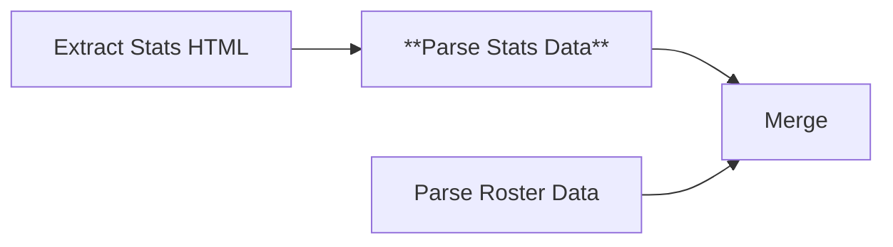

# Node 12: Parse Stats Data

## Purpose
Executes JavaScript code to parse extracted HTML statistics elements, extracting structured player performance data including games played, goals, assists, and other soccer statistics.

## Node Type
`n8n-nodes-base.code` (v2)

## Position in Workflow


## Input Schema
```json
{
  "playerRows": [
    "<tr><td><a href=\"/player/john-doe\">John Doe</a></td><td>1</td><td>12</td><td>10</td><td>5</td><td>3</td><td>13</td><td>25</td><td>15</td></tr>",
    "..."
  ],
  "fullTable": [
    "<table>...</table>"
  ]
}
```

## Configuration
JavaScript code that:
1. Filters header rows and invalid entries
2. Extracts player statistics using cell-based parsing
3. Validates player names and numeric data
4. Structures data for CSV output

## Core JavaScript Logic

### Input Processing
```javascript
const inputData = $input.all()[0].json;
const playerRows = inputData.playerRows || [];
let fullTable = inputData.fullTable || '';
const year = $('split into batches').item.json.year;

// Ensure fullTable is a string
if (Array.isArray(fullTable)) {
  fullTable = fullTable[0] || '';
}

console.log(`Processing stats for year: ${year}`);
console.log(`Found ${playerRows.length} player rows to parse`);
```

### Row Filtering Functions
```javascript
// Helper function to check if a string looks like a header
function isHeaderRow(row) {
  const lowerRow = row.toLowerCase();
  return lowerRow.includes('<th>') || 
         lowerRow.includes('player') || 
         lowerRow.includes('name') ||
         lowerRow.includes('position') ||
         lowerRow.includes('games');
}

// Helper function to validate player name (Enhanced Version)
function isValidPlayerName(name) {
  if (!name || typeof name !== 'string') return false;
  
  const trimmedName = name.trim();
  if (trimmedName.length < 2 || !isNaN(Number(trimmedName))) return false;
  
  // Expanded list of invalid names and sports-related terms
  const invalidNames = [
    'total', 'totals', '-', 'n/a', 'tbd', 'team', 'coach', 'assistant',
    'shots', 'penalties', 'miscellaneous', 'points', 'goals', 'assists',
    'shots on goal', 'saves', 'fouls', 'corner kicks', 'opponent', 'tm',
    'harding', 'university'
  ];
  
  // Pattern matching to filter out dates, scores, game results, etc.
  const invalidPatterns = [
    /^\d{2}\/\d{2}\/\d{4}$/, // Date pattern
    /^[A-Z\s]+$/,           // All caps (likely headers)
    /^\d+-\d+$/,            // Score pattern  
    /^[LWT]$/,              // Game result (Loss/Win/Tie)
    /^\(\d+-\d+-\d+/,       // Record pattern
    /^\d+:\d+$/             // Time pattern
  ];
  
  if (invalidNames.includes(trimmedName.toLowerCase())) return false;
  
  for (const pattern of invalidPatterns) {
    if (pattern.test(trimmedName)) return false;
  }
  
  // Must contain at least one letter and one space (typical name format)
  if (!/[a-zA-Z]/.test(trimmedName) || !/\s/.test(trimmedName)) return false;
  
  return true;
}
```

### Cell Content Extraction
```javascript
// Helper function to clean cell content
function cleanCellContent(cell) {
  if (!cell) return '';
  
  // Remove opening and closing td tags
  let content = cell.replace(/<\/?td[^>]*>/gi, '');
  
  // If there's a link, extract just the text
  if (content.includes('<a')) {
    const linkMatch = content.match(/>([^<]+)</);
    content = linkMatch ? linkMatch[1] : content;
  }
  
  // Remove any remaining HTML tags
  content = content.replace(/<[^>]+>/g, '');
  
  // Clean up whitespace and special characters
  content = content.replace(/&nbsp;/g, ' ')
                  .replace(/&amp;/g, '&')
                  .replace(/&lt;/g, '<')
                  .replace(/&gt;/g, '>')
                  .replace(/&quot;/g, '"')
                  .replace(/\s+/g, ' ')
                  .trim();
  
  return content;
}
```

### Statistics Data Extraction
```javascript
// Process each player row
playerRows.forEach((row, index) => {
  try {
    if (typeof row !== 'string' || isHeaderRow(row)) {
      return;
    }
    
    // Extract all cells from this row
    const cells = row.match(/<td[^>]*>(.*?)<\/td>/gi) || [];
    
    // Clean each cell
    const cleanedData = cells.map(cleanCellContent);
    
    // Make sure we have enough data (at least name)
    if (cleanedData.length < 1) {
      return;
    }
    
    // Check if first cell looks like a player name
    const playerName = cleanedData[0];
    if (!isValidPlayerName(playerName)) {
      return;
    }
    
    // Enhanced player stats object with individual statistics format
    // Expected columns: #, Player, GP, GS, MIN, G, A, PTS, SH, SH%, SOG, SOG%, YC-RC, GW, PG-PA
    let playerName, jerseyNum;
    
    // Handle different table formats
    if (cleanedData.length >= 8) {
      // Format 1: Jersey#, Player, GP, GS, MIN, G, A, PTS, ...
      if (!isNaN(Number(cleanedData[0]))) {
        jerseyNum = cleanedData[0];
        playerName = cleanedData[1];
      }
      // Format 2: Player, Jersey#, GP, GS, ...
      else {
        playerName = cleanedData[0];
        jerseyNum = !isNaN(Number(cleanedData[1])) ? cleanedData[1] : '';
      }
    } else {
      // Fallback: assume first field is player name
      playerName = cleanedData[0];
      jerseyNum = cleanedData[1] || '';
    }
    
    const playerStats = {
      section_type: 'stats',
      season: year,
      name: playerName,
      jersey_number: jerseyNum,
      GP: cleanedData[2] || '0',     // Games Played
      GS: cleanedData[3] || '0',     // Games Started
      MIN: cleanedData[4] || '0',    // Minutes
      G: cleanedData[5] || '0',      // Goals
      A: cleanedData[6] || '0',      // Assists
      PTS: cleanedData[7] || '0',    // Points
      SH: cleanedData[8] || '0',     // Shots
      SH_PCT: cleanedData[9] || '0', // Shot Percentage
      SOG: cleanedData[10] || '0',   // Shots on Goal
      SOG_PCT: cleanedData[11] || '0', // SOG Percentage
      YC_RC: cleanedData[12] || '0', // Yellow/Red Cards
      GW: cleanedData[13] || '0',    // Game Winners
      PG_PA: cleanedData[14] || '0'  // Penalty Goals/Attempts
    };
    
    statsItems.push(playerStats);
    console.log(`Added stats for: ${playerName}`);
    
  } catch (error) {
    console.error(`Error parsing row ${index}:`, error);
  }
});
```

## Output Schema (Enhanced)
```json
[
  {
    "section_type": "stats",
    "season": "2024-25",
    "name": "John Doe",
    "jersey_number": "1",
    "GP": "12",
    "GS": "10",
    "MIN": "890",
    "G": "5",
    "A": "3",
    "PTS": "13",
    "SH": "25",
    "SH_PCT": "20.0",
    "SOG": "15",
    "SOG_PCT": "60.0",
    "YC_RC": "2",
    "GW": "1",
    "PG_PA": "0"
  },
  "..."
]
```

## Statistics Column Mapping (Enhanced)
```javascript
// Enhanced individual player statistics columns
const statColumns = {
  0: 'jersey_number',  // Jersey number (#)
  1: 'name',           // Player name
  2: 'GP',             // Games played
  3: 'GS',             // Games started
  4: 'MIN',            // Minutes played
  5: 'G',              // Goals
  6: 'A',              // Assists
  7: 'PTS',            // Points (Goals + Assists)
  8: 'SH',             // Shots
  9: 'SH_PCT',         // Shot percentage
  10: 'SOG',           // Shots on goal
  11: 'SOG_PCT',       // Shots on goal percentage
  12: 'YC_RC',         // Yellow cards - Red cards
  13: 'GW',            // Game winners
  14: 'PG_PA'          // Penalty goals - Penalty attempts
};
```

## Success Criteria
- Extracts at least one valid player statistics record
- Preserves all available statistical data
- Maintains data consistency across seasons
- Filters out non-player entries effectively

## Error Scenarios

### Empty Statistics Data
- **Cause**: Pre-season period, no games played, statistics not published
- **Detection**: Empty playerRows array
- **Handling**: Returns debug information with empty stats list
- **Improvement**: Add pre-season detection and appropriate messaging

### Header Row Contamination
- **Cause**: CSS selectors include header rows in data extraction
- **Detection**: Rows containing column names instead of player data
- **Handling**: Filtered out using `isHeaderRow()` function
- **Improvement**: More robust header detection patterns

### Inconsistent Column Structure
- **Cause**: Different statistics formats by season or website updates
- **Detection**: Unexpected cell counts, parsing errors
- **Handling**: Assigns empty values to missing columns
- **Improvement**: Dynamic column mapping based on table headers

### Invalid Player Names
- **Cause**: Total rows, summary rows, malformed data
- **Detection**: Names that fail validation (numbers, reserved words)
- **Handling**: Filtered out using `isValidPlayerName()` function
- **Improvement**: More comprehensive name validation

### Malformed HTML Cells
- **Cause**: Broken HTML tags, encoding issues
- **Detection**: Regex parsing failures, empty cell extraction
- **Handling**: Continue processing with available data
- **Improvement**: Add HTML validation and repair

## Testing

### Test Data Examples
```javascript
// Valid statistics row
const validStatsRow = '<tr><td><a href="/player/john-doe">John Doe</a></td><td>1</td><td>12</td><td>10</td><td>5</td><td>3</td><td>13</td><td>25</td><td>15</td></tr>';

// Header row (should be filtered)
const headerRow = '<tr><th>Player</th><th>No.</th><th>GP</th><th>GS</th><th>G</th><th>A</th><th>PTS</th><th>SH</th><th>SOG</th></tr>';

// Total row (should be filtered) 
const totalRow = '<tr><td>TOTALS</td><td>-</td><td>120</td><td>100</td><td>45</td><td>30</td><td>120</td><td>250</td><td>150</td></tr>';
```

### Validation Checks
```javascript
// Validate extracted statistics data
const validateStats = (stats) => {
  return {
    hasValidName: isValidPlayerName(stats.name),
    hasNumericStats: ['GP', 'G', 'A', 'PTS'].every(stat => 
      !isNaN(stats[stat]) || stats[stat] === ''),
    hasMinimumData: stats.name && (stats.GP || stats.G || stats.A),
    hasReasonableValues: parseInt(stats.GP) >= 0 && 
                        parseInt(stats.G) >= 0 &&
                        parseInt(stats.A) >= 0
  };
};
```

### Debug Checklist
1. ✅ Is the input playerRows array properly populated?
2. ✅ Are header and total rows being filtered correctly?
3. ✅ Are table cells being extracted and cleaned properly?
4. ✅ Is the current year context being accessed correctly?
5. ✅ Are numeric statistics being preserved correctly?

## Common Issues

### Empty Statistics (Pre-season)
```javascript
// Handle pre-season scenarios
if (statsItems.length === 0) {
  return [{
    json: {
      section_type: 'stats',
      season: year,
      message: 'No statistics available - may be pre-season',
      status: 'no_data'
    }
  }];
}
```

### Inconsistent Cell Counts
```javascript
// Handle rows with varying cell counts
const expectedCellCount = 9; // Minimum expected cells
if (cleanedData.length < expectedCellCount) {
  // Pad with empty strings
  while (cleanedData.length < expectedCellCount) {
    cleanedData.push('');
  }
}
```

### Special Characters in Statistics
```javascript
// Handle special characters in numeric fields
const cleanNumericValue = (value) => {
  return value.replace(/[^\d.-]/g, '') || '0';
};
```

## Improvements Needed
1. **Dynamic Column Mapping**: Detect table headers and map columns dynamically
2. **Data Type Validation**: Ensure numeric fields contain valid numbers
3. **Comprehensive Name Validation**: Better detection of player vs non-player entries
4. **Error Recovery**: Handle malformed HTML more gracefully
5. **Statistics Validation**: Validate statistical relationships (e.g., PTS = G + A)

## Enhanced Statistics Validation
```javascript
// Validate statistical relationships
const validateStatisticsLogic = (stats) => {
  const gp = parseInt(stats.GP) || 0;
  const gs = parseInt(stats.GS) || 0;
  const g = parseInt(stats.G) || 0;
  const a = parseInt(stats.A) || 0;
  const pts = parseInt(stats.PTS) || 0;
  
  return {
    validGameCounts: gs <= gp, // Games started <= Games played
    validPoints: pts === (g + a) || pts === 0, // Points = Goals + Assists
    validRanges: [gp, gs, g, a, pts].every(val => val >= 0 && val <= 100)
  };
};
```

## Data Quality Assurance
```javascript
// Quality checks for extracted statistics
const qualityReport = {
  totalRows: playerRows.length,
  validPlayers: statsItems.length,
  playersWithGames: statsItems.filter(p => parseInt(p.GP) > 0).length,
  playersWithGoals: statsItems.filter(p => parseInt(p.G) > 0).length,
  playersWithAssists: statsItems.filter(p => parseInt(p.A) > 0).length,
  averageGamesPlayed: statsItems.reduce((sum, p) => sum + parseInt(p.GP || 0), 0) / statsItems.length
};

console.log('Statistics parsing quality report:', qualityReport);
```

## Dependencies
- Valid HTML input from Extract Stats HTML
- Consistent access to batch context for year information
- Regex support in n8n JavaScript environment

## Related Nodes
- **Upstream**: [10 - Extract Stats HTML](10-extract-stats-html.md)
- **Downstream**: [13 - Merge](13-merge.md)
- **Parallel**: [11 - Parse Roster Data](11-parse-roster-data.md)
- **Context**: [05 - Split Into Batches](05-split-into-batches.md)