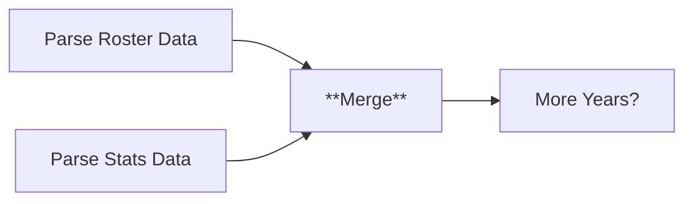
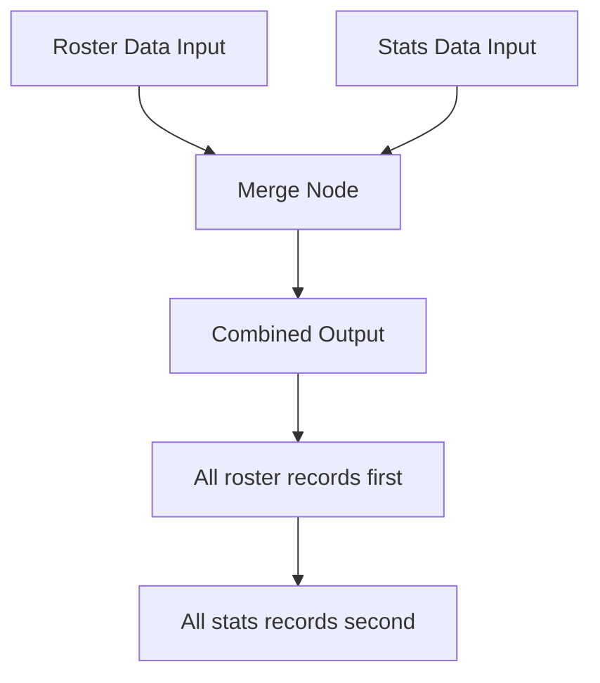

# Node 13: Merge

## Purpose
Combines the parsed roster data and statistics data from parallel processing branches, creating a unified dataset containing both biographical and performance information for each season.

## Node Type
`n8n-nodes-base.merge` (v3.2)

## Position in Workflow


## Input Schema

### Input 1 (Roster Data)
```json
[
  {
    "section_type": "roster",
    "season": "2024-25",
    "name": "John Doe",
    "jersey_number": "1",
    "position": "GK",
    "height": "6'2\"",
    "weight": "185",
    "year_in_school": "Sr",
    "hometown": "Chicago, IL"
  },
  "..."
]
```

### Input 2 (Statistics Data)
```json
[
  {
    "section_type": "stats",
    "season": "2024-25", 
    "name": "John Doe",
    "jersey_number": "1",
    "GP": "12",
    "GS": "10",
    "G": "5",
    "A": "3",
    "PTS": "13",
    "SH": "25",
    "SOG": "15"
  },
  "..."
]
```

## Configuration
```json
{
  "mode": "combine",
  "combineBy": "combineAll",
  "options": {}
}
```

### Configuration Details
- **Mode**: Combine - merges inputs from multiple branches
- **Combine By**: Combine All - includes all items from all inputs
- **Behavior**: No deduplication or matching - simple concatenation
- **Order**: Preserves input order (roster first, then stats)

## Output Schema
```json
[
  {
    "section_type": "roster",
    "season": "2024-25",
    "name": "John Doe",
    "jersey_number": "1",
    "position": "GK",
    "height": "6'2\"",
    "weight": "185",
    "year_in_school": "Sr",
    "hometown": "Chicago, IL"
  },
  {
    "section_type": "stats",
    "season": "2024-25",
    "name": "John Doe", 
    "jersey_number": "1",
    "GP": "12",
    "GS": "10",
    "G": "5",
    "A": "3",
    "PTS": "13",
    "SH": "25",
    "SOG": "15"
  },
  "..."
]
```

## Merge Behavior

### Data Flow


### Combination Strategy
- **Simple Concatenation**: No complex joining or matching
- **Preserve Structure**: Maintains original data structure from each input
- **Section Identification**: Uses `section_type` field to distinguish data types
- **Order Preservation**: Roster data appears before statistics data

## Success Criteria
- Combines data from both input branches
- Preserves all records from both roster and statistics
- Maintains data integrity and structure
- Passes combined data to downstream processing

## Error Scenarios

### Missing Input Branch
- **Cause**: One of the parsing nodes fails or returns no data
- **Detection**: Merge receives input from only one branch
- **Handling**: Continues with available data
- **Impact**: Incomplete dataset (only roster or only stats)

### Empty Data Sets
- **Cause**: Both parsing nodes return empty results
- **Detection**: Merge node receives no items
- **Handling**: Passes empty result downstream
- **Impact**: No data for current season iteration

### Data Structure Mismatches
- **Cause**: Parsing nodes return different data structures
- **Detection**: Inconsistent field names or structures in output
- **Handling**: Preserves original structures as-is
- **Impact**: May complicate downstream processing

### Memory Limitations
- **Cause**: Large datasets from multiple seasons
- **Detection**: Performance degradation, memory errors
- **Handling**: n8n default memory management
- **Improvement**: Consider streaming or batching for large datasets

## Testing

### Test Data Verification
```javascript
// Verify merge output contains both data types
const mergedData = output;
const rosterRecords = mergedData.filter(item => item.section_type === 'roster');
const statsRecords = mergedData.filter(item => item.section_type === 'stats');

console.log(`Merged data contains ${rosterRecords.length} roster records`);
console.log(`Merged data contains ${statsRecords.length} stats records`);
```

### Data Integrity Checks
```javascript
// Verify data structure preservation
const hasRequiredFields = mergedData.every(item => {
  return item.section_type && item.season && item.name;
});

const uniqueSeasons = [...new Set(mergedData.map(item => item.season))];
console.log(`Data spans seasons: ${uniqueSeasons.join(', ')}`);
```

### Debug Checklist
1. ✅ Are both roster and statistics inputs being received?
2. ✅ Is the combined output preserving all input records?
3. ✅ Are data structures from both branches maintained?
4. ✅ Is the section_type field correctly identifying data types?

## Alternative Merge Strategies

### Player-Based Joining
```javascript
// Alternative: Match roster and stats by player name
// (Not currently implemented, but could be considered)
const joinedData = rosterData.map(rosterPlayer => {
  const playerStats = statsData.find(statsPlayer => 
    statsPlayer.name === rosterPlayer.name &&
    statsPlayer.season === rosterPlayer.season
  );
  
  return {
    ...rosterPlayer,
    ...playerStats,
    section_type: 'combined'
  };
});
```

### Improved Configuration
```json
{
  "mode": "combine",
  "combineBy": "combineAll",
  "options": {
    "includeUnpaired": true,
    "mergeDuplicates": false
  }
}
```

## Data Flow Analysis

### Expected Data Volume
```javascript
// Typical data volumes per season:
const expectedVolume = {
  rosterPlayers: 25,      // ~25 players per roster
  statsPlayers: 20,       // ~20 players with game statistics
  totalRecords: 45,       // Combined roster + stats records
  fieldsPerRecord: 15     // Average fields per record
};
```

### Memory Usage
- **Roster Data**: ~25 records × 8 fields = 200 data points
- **Statistics Data**: ~20 records × 9 fields = 180 data points  
- **Combined**: ~45 records total per season
- **Multi-Season**: Accumulates across all processed seasons

## Improvements Needed
1. **Data Validation**: Verify input data structure before merging
2. **Player Matching**: Consider joining roster and stats by player name
3. **Error Handling**: Graceful handling of mismatched or corrupted data
4. **Performance Optimization**: Memory-efficient handling of large datasets
5. **Data Quality Reporting**: Log merge statistics and data quality metrics

## Enhanced Merge Configuration
```json
{
  "mode": "combine",
  "combineBy": "combineAll",
  "options": {
    "includeUnpaired": true,
    "clashHandling": "addSuffix",
    "skipEmptyValues": false
  }
}
```

## Quality Assurance
```javascript
// Post-merge data quality checks
const qualityMetrics = {
  totalRecords: mergedData.length,
  rosterRecords: mergedData.filter(r => r.section_type === 'roster').length,
  statsRecords: mergedData.filter(r => r.section_type === 'stats').length,
  uniquePlayers: [...new Set(mergedData.map(r => r.name))].length,
  seasonsRepresented: [...new Set(mergedData.map(r => r.season))].length,
  recordsWithNames: mergedData.filter(r => r.name && r.name.length > 0).length
};

console.log('Merge quality metrics:', qualityMetrics);
```

## Dependencies
- Valid input from Parse Roster Data node
- Valid input from Parse Stats Data node
- n8n merge functionality
- Consistent data structure from upstream nodes

## Related Nodes
- **Upstream**: [11 - Parse Roster Data](11-parse-roster-data.md), [12 - Parse Stats Data](12-parse-stats-data.md)
- **Downstream**: [14 - More Years?](14-more-years.md)
- **Function**: Data combination and flow control