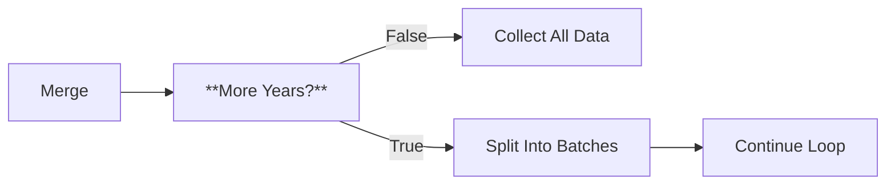
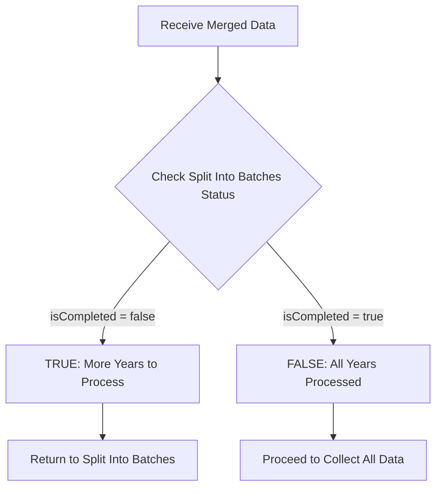

# Node 14: More Years?

## Purpose
Implements conditional logic to control the workflow loop, determining whether to continue processing additional seasons or proceed to final data collection and CSV generation.

## Node Type
`n8n-nodes-base.if` (v2.2)

## Position in Workflow


## Input Schema
```json
[
  {
    "section_type": "roster",
    "season": "2024-25",
    "name": "John Doe",
    "...": "..."
  },
  {
    "section_type": "stats", 
    "season": "2024-25",
    "name": "John Doe",
    "...": "..."
  },
  "..."
]
```

## Configuration
```json
{
  "conditions": {
    "options": {
      "caseSensitive": true,
      "leftValue": "",
      "typeValidation": "loose",
      "version": 2
    },
    "conditions": [
      {
        "id": "9dd60e75-6d79-4bff-a2ba-6be4d26b1a2b",
        "leftValue": "={{ $('split into batches').isCompleted }}",
        "rightValue": "false",
        "operator": {
          "type": "boolean",
          "operation": "equals"
        }
      }
    ],
    "combinator": "and"
  },
  "looseTypeValidation": true,
  "options": {}
}
```

### Configuration Details
- **Condition Type**: Boolean comparison
- **Left Value**: `$('split into batches').isCompleted` - references batch completion status
- **Right Value**: `false` - checks if batching is NOT completed
- **Operator**: Equals operation
- **Logic**: If batching is NOT completed, continue loop (True branch)

## Logic Flow


## Branch Behavior

### True Branch (Continue Loop)
- **Condition**: `$('split into batches').isCompleted === false`
- **Action**: Routes data back to Split Into Batches node
- **Purpose**: Continue processing remaining seasons
- **Data**: Passes merged data from current iteration

### False Branch (Complete Processing)
- **Condition**: `$('split into batches').isCompleted === true`
- **Action**: Routes data to Collect All Data node
- **Purpose**: Begin final data aggregation and CSV generation
- **Data**: Passes all accumulated data

## Success Criteria
- Correctly evaluates batch completion status
- Routes data to appropriate branch based on condition
- Maintains workflow state consistency
- Enables proper loop termination

## Error Scenarios

### Invalid Batch Context
- **Cause**: Reference to Split Into Batches node fails or returns undefined
- **Detection**: Expression evaluation errors, null reference exceptions
- **Handling**: Currently none (workflow may fail)
- **Improvement**: Add null checks and default values

### Infinite Loop Risk
- **Cause**: Batch completion status never becomes true
- **Detection**: Workflow runs indefinitely, excessive resource usage
- **Handling**: n8n execution timeout (default limits)
- **Improvement**: Add maximum iteration counter

### State Inconsistency
- **Cause**: Batch state becomes corrupted or inconsistent
- **Detection**: Unexpected routing behavior, data loss
- **Handling**: Workflow may terminate unexpectedly
- **Improvement**: Add state validation and recovery

### Missing Data Context
- **Cause**: Referenced node context is not available
- **Detection**: Expression evaluation returns undefined
- **Handling**: May default to false condition
- **Improvement**: Explicit error handling for missing context

## Testing

### Manual Condition Testing
```javascript
// Test the condition logic
const batchNode = $('split into batches');
const isCompleted = batchNode.isCompleted;
console.log('Batch completion status:', isCompleted);
console.log('Condition result:', isCompleted === false);
```

### Loop Iteration Tracking
```javascript
// Track loop iterations for debugging
const currentIteration = $('split into batches').batchIndex || 0;
const totalItems = $('split into batches').totalItems || 0;
console.log(`Processing iteration ${currentIteration} of ${totalItems}`);
```

### Debug Checklist
1. ✅ Is the Split Into Batches node reference accessible?
2. ✅ Is the isCompleted property returning expected boolean values?
3. ✅ Are both True and False branches properly configured?
4. ✅ Is the workflow routing correctly based on the condition?

## Condition Expression Analysis
```javascript
// Expression breakdown:
// $('split into batches')     - References the Split Into Batches node
// .isCompleted               - Accesses the completion status property
// === false                  - Checks if NOT completed (continue loop)

// Alternative expressions could include:
// !$('split into batches').isCompleted
// $('split into batches').batchIndex < $('split into batches').totalItems
```

## Flow Control Patterns

### Current Pattern: Completion-Based
```javascript
// Advantages:
// - Simple boolean check
// - Built-in batch management
// - Automatic termination

// Disadvantages: 
// - Relies on internal n8n state
// - Limited error handling
// - No manual override capability
```

### Alternative Patterns
```javascript
// Manual counter approach:
const processedYears = $('split into batches').batchIndex + 1;
const totalYears = $('parse available years').length;
const hasMoreYears = processedYears < totalYears;

// Time-based limits:
const startTime = $workflow.startedAt;
const maxDuration = 10 * 60 * 1000; // 10 minutes
const hasTimeRemaining = Date.now() - startTime < maxDuration;
```

## Improvements Needed
1. **Error Handling**: Add validation for batch context availability
2. **Loop Protection**: Implement maximum iteration limits
3. **State Validation**: Verify batch state consistency
4. **Logging**: Add detailed condition evaluation logging
5. **Manual Override**: Allow manual loop termination conditions

## Enhanced Condition Configuration
```json
{
  "conditions": {
    "conditions": [
      {
        "leftValue": "={{ $('split into batches').isCompleted }}",
        "rightValue": "false",
        "operator": {
          "type": "boolean", 
          "operation": "equals"
        }
      },
      {
        "leftValue": "={{ $('split into batches').batchIndex }}",
        "rightValue": "100",
        "operator": {
          "type": "number",
          "operation": "lt"
        }
      }
    ],
    "combinator": "and"
  }
}
```

## Performance Considerations
- **Memory Accumulation**: Each iteration adds to memory usage
- **Processing Time**: Total time scales with number of years
- **Resource Usage**: Workflow holds all data in memory during processing
- **Optimization**: Consider streaming approaches for large datasets

## Dependencies
- Valid reference to Split Into Batches node
- Consistent batch state management
- Proper n8n node context preservation
- Reliable boolean evaluation

## Related Nodes
- **Upstream**: [13 - Merge](13-merge.md)
- **True Branch**: [05 - Split Into Batches](05-split-into-batches.md) (loop back)
- **False Branch**: [15 - Collect All Data](15-collect-all-data.md)
- **Control Flow**: Loop termination logic