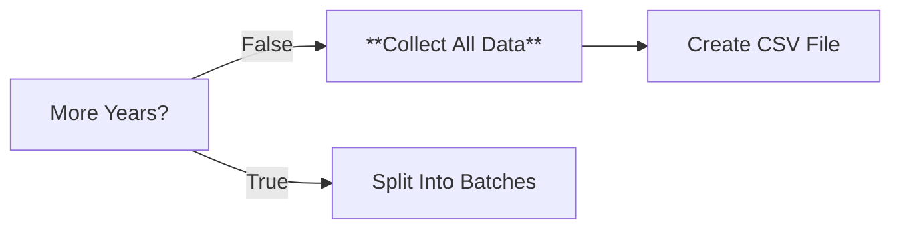

# Node 15: Collect All Data

## Purpose
Executes JavaScript code to aggregate and consolidate all collected player data from multiple seasons, filtering out debug entries and preparing the dataset for CSV conversion.

## Node Type
`n8n-nodes-base.code` (v2)

## Position in Workflow


## Input Schema
```json
[
  {
    "section_type": "roster",
    "season": "2024-25",
    "name": "John Doe",
    "jersey_number": "1",
    "position": "GK",
    "height": "6'2\"",
    "weight": "185",
    "year_in_school": "Sr",
    "hometown": "Chicago, IL"
  },
  {
    "section_type": "stats",
    "season": "2024-25",
    "name": "John Doe",
    "jersey_number": "1",
    "GP": "12",
    "GS": "10",
    "G": "5",
    "A": "3",
    "PTS": "13",
    "SH": "25",
    "SOG": "15"
  },
  "... (data from all seasons)"
]
```

## Configuration
JavaScript code that:
1. Filters out debug entries and invalid records
2. Creates a standardized CSV-ready data structure
3. Handles missing fields with empty defaults
4. Provides summary statistics and error reporting

## Core JavaScript Logic

### Input Processing
```javascript
// Collect all the data from all iterations
const allData = $input.all();

console.log(`Collecting data from ${allData.length} items`);

// Filter out any debug entries and collect valid player data
const validData = allData.filter(item => 
  item.json && 
  (item.json.section_type === 'roster' || item.json.section_type === 'stats') &&
  !item.json.debug &&
  item.json.name
);

console.log(`Found ${validData.length} valid data entries`);
```

### Data Filtering
```javascript
// Filtering criteria:
// 1. Must have json property
// 2. Must be either 'roster' or 'stats' section_type
// 3. Must not be a debug entry
// 4. Must have a valid name field
```

### CSV Data Structure Creation
```javascript
// If we have data, create CSV-ready format
if (validData.length > 0) {
  // Create a flattened structure suitable for CSV
  const csvData = validData.map(item => {
    const data = item.json;
    return {
      section_type: data.section_type,
      season: data.season,
      name: data.name || '',
      jersey_number: data.jersey_number || '',
      position: data.position || '',
      height: data.height || '',
      weight: data.weight || '',
      year_in_school: data.year_in_school || '',
      hometown: data.hometown || '',
      games_played: data.GP || '',
      games_started: data.GS || '',
      goals: data.G || '',
      assists: data.A || '',
      points: data.PTS || '',
      shots: data.SH || '',
      shots_on_goal: data.SOG || ''
    };
  });
  
  console.log(`Prepared ${csvData.length} rows for CSV`);
  
  return csvData.map(row => ({ json: row }));
}
```

## Output Schema
```json
[
  {
    "section_type": "roster",
    "season": "2024-25",
    "name": "John Doe",
    "jersey_number": "1",
    "position": "GK",
    "height": "6'2\"",
    "weight": "185",
    "year_in_school": "Sr",
    "hometown": "Chicago, IL",
    "games_played": "",
    "games_started": "",
    "goals": "",
    "assists": "",
    "points": "",
    "shots": "",
    "shots_on_goal": ""
  },
  {
    "section_type": "stats",
    "season": "2024-25",
    "name": "John Doe",
    "jersey_number": "1",
    "position": "",
    "height": "",
    "weight": "",
    "year_in_school": "",
    "hometown": "",
    "games_played": "12",
    "games_started": "10",
    "goals": "5",
    "assists": "3",
    "points": "13",
    "shots": "25",
    "shots_on_goal": "15"
  },
  "..."
]
```

## CSV Column Mapping
```javascript
const columnMapping = {
  // Core identification
  section_type: 'section_type',
  season: 'season',
  name: 'name',
  jersey_number: 'jersey_number',
  
  // Roster-specific fields
  position: 'position',
  height: 'height', 
  weight: 'weight',
  year_in_school: 'year_in_school',
  hometown: 'hometown',
  
  // Statistics-specific fields (mapped from abbreviations)
  games_played: 'GP',
  games_started: 'GS',
  goals: 'G',
  assists: 'A',
  points: 'PTS',
  shots: 'SH',
  shots_on_goal: 'SOG'
};
```

## Success Criteria
- Successfully aggregates data from all processed seasons
- Filters out debug and invalid entries
- Creates consistent CSV-ready data structure
- Preserves all available player information

## Error Scenarios

### No Valid Data
- **Cause**: All processing failed, only debug entries generated
- **Detection**: Empty validData array after filtering
- **Handling**: Returns summary message with error details
- **Impact**: No CSV file generated

### Partial Data Loss
- **Cause**: Some seasons failed to process correctly
- **Detection**: Lower than expected data count
- **Handling**: Continue with available data
- **Improvement**: Add data completeness reporting

### Memory Limitations
- **Cause**: Large datasets from many seasons accumulate
- **Detection**: Performance degradation, memory errors
- **Handling**: JavaScript engine limits
- **Improvement**: Streaming or chunked processing

### Data Structure Inconsistencies
- **Cause**: Different field structures from upstream processing
- **Detection**: Missing or malformed fields in output
- **Handling**: Default empty values for missing fields
- **Improvement**: Schema validation and normalization

## Testing

### Data Volume Validation
```javascript
// Validate expected data volumes
const expectedMinimum = {
  seasonsProcessed: 2,
  playersPerSeason: 20,
  recordsPerPlayer: 2, // roster + stats
  minimumTotalRecords: 80
};

const actualCounts = {
  totalRecords: validData.length,
  uniqueSeasons: [...new Set(validData.map(d => d.json.season))].length,
  uniquePlayers: [...new Set(validData.map(d => d.json.name))].length,
  rosterRecords: validData.filter(d => d.json.section_type === 'roster').length,
  statsRecords: validData.filter(d => d.json.section_type === 'stats').length
};
```

### Data Quality Checks
```javascript
// Validate data quality
const qualityMetrics = {
  recordsWithNames: validData.filter(d => d.json.name && d.json.name.length > 0).length,
  recordsWithSeasons: validData.filter(d => d.json.season).length,
  recordsWithJerseyNumbers: validData.filter(d => d.json.jersey_number).length,
  debugEntriesFiltered: allData.length - validData.length
};

console.log('Data quality metrics:', qualityMetrics);
```

### Debug Checklist
1. ✅ Is the input data array properly populated from all iterations?
2. ✅ Are debug entries being filtered out correctly?
3. ✅ Is the CSV data structure complete and consistent?
4. ✅ Are all seasons represented in the final dataset?

## Error Handling

### No Data Scenario
```javascript
// If no valid data found, return summary
if (validData.length === 0) {
  return [{
    json: {
      message: 'No valid player data found',
      totalItems: allData.length,
      debugEntries: allData.filter(item => item.json && item.json.debug).length,
      status: 'no_data'
    }
  }];
}
```

### Data Completeness Report
```javascript
// Generate data completeness report
const completenessReport = {
  totalInputItems: allData.length,
  validRecords: validData.length,
  filteredOutRecords: allData.length - validData.length,
  seasonsProcessed: [...new Set(validData.map(d => d.json.season))],
  recordsByType: {
    roster: validData.filter(d => d.json.section_type === 'roster').length,
    stats: validData.filter(d => d.json.section_type === 'stats').length
  }
};

console.log('Data collection completeness:', completenessReport);
```

## Improvements Needed
1. **Data Validation**: Comprehensive schema validation before CSV conversion
2. **Duplicate Detection**: Identify and handle duplicate records
3. **Data Enrichment**: Add calculated fields or data transformations
4. **Error Reporting**: Detailed reporting of filtered records and reasons
5. **Performance Optimization**: Memory-efficient processing for large datasets

## Enhanced Data Processing
```javascript
// Advanced data processing features
const enhancedProcessing = {
  deduplication: true,
  dataValidation: true,
  calculatedFields: true,
  errorReporting: true
};

// Deduplicate records based on name, season, and section_type
const deduplicatedData = validData.filter((record, index, array) => {
  const key = `${record.json.name}-${record.json.season}-${record.json.section_type}`;
  return array.findIndex(r => 
    `${r.json.name}-${r.json.season}-${r.json.section_type}` === key
  ) === index;
});
```

## Data Transformation Pipeline
```javascript
// Complete data transformation pipeline
const transformationSteps = [
  'filterValidRecords',
  'deduplicateEntries', 
  'normalizeFieldNames',
  'addCalculatedFields',
  'validateDataIntegrity',
  'formatForCSV'
];

// Each step processes and validates the data
```

## Dependencies
- Valid input data from all previous workflow iterations
- Consistent data structure from upstream nodes
- JavaScript processing capabilities in n8n
- Memory availability for data aggregation

## Related Nodes
- **Upstream**: [14 - More Years?](14-more-years.md) (completion branch)
- **Downstream**: [16 - Create CSV File](16-create-csv-file.md)
- **Function**: Data aggregation and preparation for export