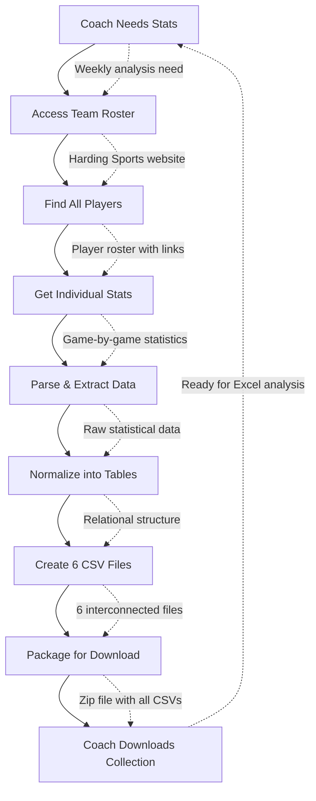

# Harding Soccer Stats Scraper - Workflow Specification

---

## 1. Overview

### Purpose & Description
* **What it does**: Automatically extracts soccer player statistics from university athletics websites and appends them to a growing multi-institutional, multi-year dataset for comprehensive sports analytics
* **Process**: Visits team roster pages, identifies all players, downloads individual statistics pages, and appends normalized data to cumulative CSV files that build over time across schools and seasons
* **Deliverable**: Cumulative dataset collection with comprehensive team, game, and player performance data from multiple universities and seasons, structured for advanced analytics and machine learning

### Benefits & Value
* **Primary benefit**: Transforms 2-3 hours of manual data collection into a 3-minute automated process while building a comprehensive multi-institutional dataset
* **Time savings**: 95% reduction in data collection time (3 hours → 3 minutes) per school per season
* **Quality improvement**: Eliminates copy-paste errors and ensures consistent data format across all institutions
* **Analytics potential**: Creates large-scale dataset enabling cross-school comparisons, recruiting insights, and predictive modeling
* **Scalability**: Single workflow supports data collection from multiple universities and seasons

### Audience
* **Primary users**: Soccer coaching staff who need regular performance data
* **Secondary users**: Athletic department administrators and student researchers
* **Stakeholders**: Athletic director, sports information office, team analysts

---

## 2. Problem & Automated Solution

### Problem Statement
Soccer coaching staff currently spend 2-3 hours manually visiting individual player pages on the Harding Sports website, copying statistics into spreadsheets, and formatting data for analysis. This process is complicated by the fact that goalkeepers have two different statistical tables (field player stats and goalkeeper-specific stats) while field players have only one table. This happens weekly during the season and monthly during off-season.

**Specific pain points:**
* Manual process consumes 6-9 hours per month of valuable coaching time
* Copy-paste errors lead to inaccurate statistics affecting coaching decisions
* Inconsistent data formatting requires additional cleanup before analysis
* Time pressure during busy season delays critical performance reviews
* Difficult to maintain historical data and track performance trends

### Solution Overview
Automated web scraping workflow that replicates the manual process but executes in minutes instead of hours. The system navigates the website like a human would, but processes all players simultaneously and ensures perfect data consistency.

**Direct benefits:**
* Reclaims 6-9 hours monthly for strategic coaching activities instead of data entry
* Guarantees 100% accuracy by eliminating human copy-paste errors
* Delivers standardized CSV format that imports directly into Excel and analytics tools
* Enables weekly data reviews instead of monthly due to reduced time commitment
* Creates foundation for advanced analytics and historical trend analysis

### Impact
* **Time reduction**: 2-3 hours → 3 minutes (95% reduction)
* **Accuracy improvement**: Zero transcription errors vs. multiple errors per session
* **Frequency increase**: Weekly reviews possible vs. monthly due to time constraints
* **Resource savings**: $200-300 worth of coaching time saved per month

---

## 3. User Experience

### Typical Usage Scenario
Coach Martinez is preparing for Monday's team meeting and needs current statistics for all players, plus he wants to see how his team compares to other universities. It's Sunday evening, and the latest games have been updated. He opens n8n, navigates to the "Soccer Stats Scraper" workflow, enters "Harding" and "2024" as parameters, and executes. Within 3 minutes, the workflow appends new Harding data to the master dataset files. He downloads the updated cumulative CSV files containing data from multiple schools and seasons, imports them into his analytics dashboard, and can now compare his players' performance against similar players from other institutions, identify recruiting targets based on historical performance patterns, and has comprehensive insights ready for tomorrow's 7 AM team meeting.

### Step-by-Step Execution
1. **Open n8n interface** → *Workflow dashboard loads* → Clean, familiar interface with workflow list
2. **Click "Soccer Stats Scraper" workflow** → *Workflow details open* → See execution history and current status
3. **Enter school and year parameters** → *Configure institution and season* → Specify which school and season to collect (e.g., "Harding", "2024")
4. **Click "Execute Workflow" button** → *Process begins automatically* → System appends new data to master dataset files
5. **Monitor progress (optional)** → *Real-time status updates* → Can see which players are being processed
6. **Download updated master dataset when complete** → *6 cumulative files with new data appended* → Growing dataset ready for advanced analytics and cross-institutional analysis

### Alternative Usage Scenarios
* **Complete GAC Analysis**: Compare all 6 GAC men's soccer schools for comprehensive conference insights
* **Championship Prediction**: Use historical data to predict GAC tournament outcomes (Fort Hays State won 2024)
* **Recruitment Intelligence**: Identify top performers across all GAC schools for strategic transfer recruitment
* **Regional Talent Mapping**: Kansas vs Oklahoma player development patterns and regional recruiting trends
* **Conference Competitive Balance**: Analyze parity across GAC schools and identify dominant programs
* **Player development tracking**: Follow individual players across multiple seasons to assess development patterns
* **Coaching strategy analysis**: Compare tactical approaches across different institutions and identify successful patterns
* **Academic research**: Support sports science research with comprehensive multi-institutional dataset
* **Predictive modeling**: Use historical multi-school data to predict player performance, team success, and recruiting outcomes

---

## 4. Technical Workflow

### High-Level Visual Diagram


### Detailed Technical Breakdown
| Node Name | Action | Input | Output | Error Impact | n8n Node Type & Documentation |
|-----------|--------|-------|--------|--------------|-------------------------------|
| Manual Trigger | User initiates workflow | Button click + School + Year parameters | Workflow start signal with institution and season | No execution possible | [Manual Trigger](https://docs.n8n.io/integrations/builtin/core-nodes/n8n-nodes-base.manualTrigger/) |
| Validate Parameters | Check school and year validity | School identifier + Year parameter | Valid parameters for URL construction | Invalid parameters stop execution | [IF Node](https://docs.n8n.io/integrations/builtin/core-nodes/n8n-nodes-base.if/) + [Function](https://docs.n8n.io/integrations/builtin/core-nodes/n8n-nodes-base.function/) |
| Identify Website Pattern | Determine school's platform type | School identifier | Website pattern (Static HTML vs SideArm CMS) | Unknown school type | [Switch Node](https://docs.n8n.io/integrations/builtin/core-nodes/n8n-nodes-base.switch/) |
| Construct URLs | Build platform-specific URLs | School pattern + validated parameters | Dynamic URLs for target institution | URL construction failure | [Function Node](https://docs.n8n.io/integrations/builtin/core-nodes/n8n-nodes-base.function/) |
| Fetch Roster | Download team roster page | School-specific roster URL | HTML roster content with player links | Complete workflow failure | [HTTP Request Node](https://docs.n8n.io/integrations/builtin/core-nodes/n8n-nodes-base.httpRequest/) |
| Load Existing Data | Read current master CSV files | Existing cumulative dataset files | Current dataset state for appending | Creates new files if none exist | [Read Binary File](https://docs.n8n.io/integrations/builtin/core-nodes/n8n-nodes-base.readBinaryFile/) + [CSV Parser](https://docs.n8n.io/integrations/builtin/core-nodes/n8n-nodes-base.function/) |
| Extract Player Links | Find individual player page URLs | HTML content | Array of links like "plyr_1.htm", "plyr_21.htm" | No players identified | [HTML Extract](https://docs.n8n.io/integrations/builtin/core-nodes/n8n-nodes-base.htmlExtract/) + [Function](https://docs.n8n.io/integrations/builtin/core-nodes/n8n-nodes-base.function/) |
| Parse Roster Data | Convert links to structured player info | Player links/HTML | Player objects with jersey numbers, positions, and full URLs | Incomplete player identification | [Function Node](https://docs.n8n.io/integrations/builtin/core-nodes/n8n-nodes-base.function/) |
| Fetch Player Pages | Download individual statistics pages | URLs like plyr_{number}.htm | HTML stats content (1-2 tables per player) | Missing data for affected players | [HTTP Request Node](https://docs.n8n.io/integrations/builtin/core-nodes/n8n-nodes-base.httpRequest/) (Loop) |
| Extract Player Stats | Convert HTML to text for parsing | HTML stats pages | Plain text statistics tables (1 or 2 tables depending on player type) | Cannot parse affected players | [HTML Extract](https://docs.n8n.io/integrations/builtin/core-nodes/n8n-nodes-base.htmlExtract/) |
| Parse Player Stats | Structure game data into records | Text statistics (field stats + goalkeeper stats for goalies) | JSON game records with appropriate statistical fields | Unusable data format | [Function Node](https://docs.n8n.io/integrations/builtin/core-nodes/n8n-nodes-base.function/) |
| Normalize Data | Split data into relational structure | JSON game records | Normalized data objects for 6 tables with school/year identifiers | Poor data quality and relationships | [Function Node](https://docs.n8n.io/integrations/builtin/core-nodes/n8n-nodes-base.function/) |
| Append to Master Files | Add new data to existing datasets | Normalized data + existing CSV files | Updated master CSV files with new data appended | Data corruption or duplicate records | [Function](https://docs.n8n.io/integrations/builtin/core-nodes/n8n-nodes-base.function/) + [Write Binary File](https://docs.n8n.io/integrations/builtin/core-nodes/n8n-nodes-base.writeBinaryFile/) |
| Deduplicate Records | Remove any duplicate entries | Updated CSV files | Clean master dataset files | Data integrity issues | [Function Node](https://docs.n8n.io/integrations/builtin/core-nodes/n8n-nodes-base.function/) |
| Generate Analytics Summary | Create data summary report | Complete master dataset | Summary statistics and data quality report | No visibility into dataset status | [Function Node](https://docs.n8n.io/integrations/builtin/core-nodes/n8n-nodes-base.function/) |

---

## 5. Data Specification

### Input Data
* **Source**: Great American Conference (GAC) Men's Soccer Division II athletics websites
* **Supported Universities & Website Patterns**:

  **Pattern A - Static HTML (Legacy Format)**:
  * **Harding University**: static.hardingsports.com
    * Team roster: `/custompages/msoc/{YEAR}/teamgbg.htm`
    * Player pages: `/custompages/msoc/{YEAR}/plyr_{number}.htm`

  **Pattern B - Modern CMS (SideArm Sports Platform)**:
  * **Ouachita Baptist University**: obutigers.com
    * Team roster: `/sports/mens-soccer/roster/{YEAR}`
  * **Fort Hays State University**: fhsuathletics.com
    * Team roster: `/sports/mens-soccer/roster`
  * **Newman University**: newmanjets.com
    * Team roster: `/sports/mens-soccer/roster`
  * **Rogers State University**: rsuhillcats.com
    * Team roster: `/sports/mens-soccer/roster`
  * **Northeastern State University**: goriverhawksgo.com
    * Team roster: `/sports/mens-soccer/roster`

* **Parameters**: 
  * School identifier (e.g., "Harding", "Ouachita_Baptist", "Fort_Hays_State", "Newman", "Rogers_State", "Northeastern_State")
  * Season year (2020-current)
* **Website Platform Analysis**: 5 of 6 schools use SideArm Sports CMS with identical URL patterns, 1 school uses legacy static HTML
* **Scalability**: High - 83% of GAC soccer schools share identical URL structure
* **Format**: HTML pages with embedded statistics (varies by platform but consistent within platform type)
* **Requirements**: Active internet connection, accessible website, valid school and year parameters
* **Data Complexity**: Two distinct parsing strategies needed - one for static HTML, one for SideArm CMS

### Output Data Schema - Relational Structure

The workflow generates 6 interconnected CSV files that function as a normalized relational database:

**1. games.csv - Master Game Records (All Schools, All Years)**
| Field | Type | Description | Example |
|-------|------|-------------|---------|
| game_id | String | Unique game identifier | "Harding_2024_game_001" |
| school | String | University identifier | "Harding" |
| season | String | Season year | "2024" |
| date | String | Game date (MM/DD/YY format) | "09/05/24" |
| opponent | String | Opposing team name | "Oklahoma Baptist" |
| score | String | Final game score (Home-Away) | "2-1" |
| location | String | Home/Away designation | "Home" |
| conference | String | Athletic conference | "Great American Conference" |
| division | String | NCAA Division | "Division II" |

**2. team_game_stats.csv - Team Statistics by Game (All Schools)**
| Field | Type | Description | Example |
|-------|------|-------------|---------|
| game_id | String | Foreign key to games table | "Harding_2024_game_001" |
| school | String | University identifier | "Harding" |
| goals_for | String | Goals scored by team | "2" |
| goals_against | String | Goals conceded by team | "1" |
| shots_total | String | Total shots by team | "18" |
| shots_on_goal | String | Shots on goal by team | "8" |
| corner_kicks | String | Corner kicks earned | "6" |
| fouls_committed | String | Fouls committed by team | "12" |
| yellow_cards | String | Yellow cards received | "2" |
| red_cards | String | Red cards received | "0" |

**3. opponent_game_stats.csv - Opponent Statistics by Game**
| Field | Type | Description | Example |
|-------|------|-------------|---------|
| game_id | String | Foreign key to games table | "game_001" |
| goals_for | String | Goals scored by opponent | "1" |
| goals_against | String | Goals conceded by opponent | "2" |
| shots_total | String | Total shots by opponent | "12" |
| shots_on_goal | String | Shots on goal by opponent | "6" |
| corner_kicks | String | Corner kicks earned by opponent | "3" |
| fouls_committed | String | Fouls committed by opponent | "15" |
| yellow_cards | String | Yellow cards received by opponent | "3" |
| red_cards | String | Red cards received by opponent | "0" |

**4. goal_events.csv - Individual Goal Details**
| Field | Type | Description | Example |
|-------|------|-------------|---------|
| event_id | String | Unique event identifier | "goal_001" |
| game_id | String | Foreign key to games table | "game_001" |
| player_id | String | Foreign key to players table | "player_021" |
| minute | String | Minute when goal was scored | "23" |
| assist_player_id | String | Player who assisted (if any) | "player_010" |
| goal_type | String | Type of goal | "Open Play" |

**5. player_game_stats.csv - Individual Player Performance by Game**
| Field | Type | Description | Example |
|-------|------|-------------|---------|
| player_id | String | Foreign key to players table | "player_021" |
| game_id | String | Foreign key to games table | "game_001" |
| games_played | String | Games played (0 or 1) | "1" |
| games_started | String | Games started (0 or 1) | "0" |
| minutes | String | Minutes played | "25" |
| goals | String | Goals scored | "0" |
| assists | String | Assists | "0" |
| shots | String | Total shots | "2" |
| shots_on_goal | String | Shots on goal | "1" |
| fouls | String | Fouls committed | "1" |
| yellow_cards | String | Yellow cards | "0" |
| red_cards | String | Red cards | "0" |
| saves | String | Saves (goalkeepers only) | "5" |
| goals_against | String | Goals against (goalkeepers only) | "1" |
| save_percentage | String | Save percentage (goalkeepers only) | "83.3" |
| shutouts | String | Shutouts (goalkeepers only) | "0" |

**6. players.csv - Player Master Data (All Schools, All Years)**
| Field | Type | Description | Example |
|-------|------|-------------|---------|
| player_id | String | Unique player identifier | "Harding_2024_player_021" |
| school | String | University identifier | "Harding" |
| season | String | Season year | "2024" |
| jersey | String | Player's jersey number | "21" |
| name | String | Player's full name | "Aitor Scholl" |
| position | String | Primary position | "Midfielder" |
| is_goalkeeper | String | Goalkeeper flag (true/false) | "false" |
| class_year | String | Academic class | "Sophomore" |
| hometown | String | Player's hometown | "Barcelona, Spain" |
| height | String | Player height | "5'10" |
| weight | String | Player weight | "165" |
| previous_school | String | Previous institution (transfers) | "Barcelona FC Academy" |

### Sample Output - Relational CSV Collection

**games.csv (Cumulative - All GAC Schools & Years)**
```
game_id,school,season,date,opponent,score,location,conference,division
Harding_2024_game_001,Harding,2024,09/05/24,Ouachita Baptist,2-1,Home,Great American Conference,Division II
Ouachita_Baptist_2024_game_001,Ouachita Baptist,2024,09/05/24,Harding,1-2,Away,Great American Conference,Division II
Fort_Hays_State_2024_game_005,Fort Hays State,2024,10/15/24,Newman,3-1,Home,Great American Conference,Division II
Newman_2024_game_012,Newman,2024,10/15/24,Fort Hays State,1-3,Away,Great American Conference,Division II
Rogers_State_2023_game_008,Rogers State,2023,09/20/23,Northeastern State,2-2,Home,Great American Conference,Division II
```

**team_game_stats.csv (Cumulative - All GAC Schools & Years)**
```
game_id,school,goals_for,goals_against,shots_total,shots_on_goal,corner_kicks,fouls_committed,yellow_cards,red_cards
Harding_2024_game_001,Harding,2,1,18,8,6,12,2,0
Ouachita_Baptist_2024_game_001,Ouachita Baptist,1,2,12,5,3,15,3,0
Fort_Hays_State_2024_game_005,Fort Hays State,3,1,22,11,8,9,1,0
Newman_2024_game_012,Newman,1,3,14,6,4,13,2,1
Rogers_State_2023_game_008,Rogers State,2,2,16,7,5,11,1,0
```

**opponent_game_stats.csv**
```
game_id,goals_for,goals_against,shots_total,shots_on_goal,corner_kicks,fouls_committed,yellow_cards,red_cards
2024_game_001,1,2,12,6,3,15,3,0
2024_game_002,0,1,9,4,2,11,2,1
```

**goal_events.csv**
```
event_id,game_id,player_id,minute,assist_player_id,goal_type
2024_goal_001,2024_game_001,2024_player_010,23,2024_player_021,Open Play
2024_goal_002,2024_game_001,2024_player_005,67,,Header
2024_goal_003,2024_game_002,2024_player_021,45,2024_player_010,Counter Attack
```

**player_game_stats.csv**
```
player_id,game_id,games_played,games_started,minutes,goals,assists,shots,shots_on_goal,fouls,yellow_cards,red_cards,saves,goals_against,save_percentage,shutouts
2024_player_021,2024_game_001,1,0,25,0,1,2,1,1,0,0,,,, 
2024_player_021,2024_game_002,1,1,90,1,0,4,2,0,0,0,,,, 
2024_player_001,2024_game_001,1,1,90,0,0,0,0,0,0,0,5,1,83.3,0
2024_player_001,2024_game_002,1,1,90,0,0,0,0,0,0,0,3,0,100.0,1
```

**players.csv (Cumulative - All GAC Schools & Years)**
```
player_id,school,season,jersey,name,position,is_goalkeeper,class_year,hometown,height,weight,previous_school
Harding_2024_player_001,Harding,2024,1,Inigo Chavarria,Goalkeeper,true,Junior,Pamplona Spain,6'2,185,Real Sociedad Youth
Ouachita_Baptist_2024_player_010,Ouachita Baptist,2024,10,Blake Morrison,Forward,false,Senior,Little Rock AR,5'11,170,Arkansas Football Club
Fort_Hays_State_2024_player_007,Fort Hays State,2024,7,Carlos Rodriguez,Midfielder,false,Junior,Wichita KS,5'9,160,Sporting Kansas City Academy
Newman_2024_player_015,Newman,2024,15,Tyler Johnson,Defender,false,Sophomore,Topeka KS,6'1,180,Sporting Kansas City II
Rogers_State_2023_player_020,Rogers State,2023,20,Jackson Smith,Forward,false,Senior,Tulsa OK,5'10,175,FC Tulsa Academy
Northeastern_State_2024_player_003,Northeastern State,2024,3,Miguel Santos,Defender,false,Freshman,Oklahoma City OK,6'0,170,Oklahoma City Energy FC Academy
```

---

## 6. Success Criteria & Quality Assurance

### Success Metrics
**Functional criteria:**
* Workflow completes within 5 minutes regardless of roster size
* All active players from roster page are processed and included
* CSV contains all available statistical categories with proper headers
* Zero manual intervention required for standard execution

**User experience criteria:**
* One-click execution for non-technical coaching staff
* Clear progress indication and meaningful error messages
* File ready for immediate Excel import without formatting issues
* Intuitive download process through n8n interface

**Business criteria:**
* 95% time reduction compared to manual process (3 hours → 3 minutes)
* 100% accuracy compared to manual data collection
* Enables weekly statistical reviews instead of monthly
* All coaching staff can execute without technical training

### Validation & Quality Checks
* **Data quality**: Verify jersey numbers and player names match official roster, validate date formats are consistent, confirm relational integrity between CSV files using foreign keys
* **Process integrity**: Confirm roster page accessed successfully, all player links functional, all 6 CSV files generated successfully, proper normalization of data across tables
* **Output validation**: Check file collection size is reasonable (300KB-2MB total), verify record counts match expected relationships (games × players for stats), confirm goalkeepers have goalkeeper-specific fields populated

---

## 7. Setup & Configuration

### Prerequisites
**Access requirements:**
* Internet connectivity to access Harding Sports website
* Access to n8n instance (cloud or self-hosted)
* Web browser for n8n interface access

**Technical setup:**
* n8n instance running version 1.x or higher
* Sufficient storage space for CSV output files (minimal - under 1MB per file)
* No special credentials required (public website data)

**Knowledge requirements:**
* Basic understanding of soccer statistics terminology
* Familiarity with CSV file handling and Excel import
* No coding or technical expertise required

### Configuration Steps
1. **Import workflow**: Upload soccer.json file through n8n import feature under "Workflows" menu
2. **Verify website access**: 
   * Test that https://static.hardingsports.com/custompages/msoc/{YEAR}/teamgbg.htm pattern works
   * Check that individual player pages are accessible for different years (e.g., 2024/plyr_1.htm, 2023/plyr_21.htm)
3. **Run test execution**: Execute workflow once with current roster to validate functionality
4. **Confirm file download**: Ensure CSV file generates properly and can be downloaded

**Note**: The workflow uses a dynamic year parameter. Users simply input the desired season year (e.g., 2024, 2023, 2022) and the system automatically constructs the appropriate URLs.

---

## 8. Operations & Troubleshooting

### Usage Instructions
**Manual execution:**
1. Open web browser and navigate to n8n interface
2. Select "Soccer Stats Scraper" from workflow list
3. Click "Execute Workflow" button in the top right
4. Monitor execution progress in the log panel (optional)
5. Download generated CSV file when "success" status appears

**Best practices:**
* Run during off-peak hours (evenings/weekends) to minimize website load
* Execute weekly during active season for fresh data
* Validate file contents before using for critical analysis
* Keep previous versions for historical comparison and backup

### Troubleshooting
| Issue | Likely Cause | Action |
|-------|--------------|--------|
| No players found in output | Website structure changed, roster page unavailable, or invalid year | 1. Verify year parameter is valid (e.g., 2024, 2023)<br>2. Check if URL loads in browser with specified year<br>3. Contact technical administrator if structure changed |
| Some players missing from results | Individual player pages temporarily unavailable | 1. Check specific player URLs (e.g., plyr_1.htm, plyr_21.htm)<br>2. Re-run workflow later, manually note missing players |
| Goalkeeper statistics incomplete | Parsing logic failed to extract both statistical tables | 1. Verify goalkeeper pages have both field and goalkeeper tables<br>2. Contact technical administrator for parsing logic review |
| Field players showing goalkeeper columns | Data parsing incorrectly identified player type | 1. Check roster page for accurate position information<br>2. Manual review of affected player pages needed |
| Execution takes longer than 10 minutes | Large roster size or slow website response | Wait for completion, consider running during off-peak hours |
| CSV file won't open in Excel | File download interrupted or corrupted | Re-run workflow to generate fresh file |
| Workflow shows "failed" status | Network connectivity issues or website down | 1. Check internet connection<br>2. Verify Harding Sports website is accessible<br>3. Try again in 30 minutes |

**Success indicators:**
* All workflow nodes show green checkmarks in execution log
* All 6 CSV files are generated and available for download as a zip collection
* File collection size is reasonable (typically 300KB-2MB depending on roster size and season length)
* All files open properly in Excel with expected columns and proper relational structure

**Failure indicators:**
* Red error indicators on any workflow nodes
* No CSV files generated or missing files from the 6-file collection
* Error messages mentioning network connectivity or parsing issues
* Execution time exceeds 15 minutes without completion

---

## 9. Maintenance & Enhancements

### Routine Maintenance
**Weekly (during active season):**
* Verify workflow executes successfully with current roster
* Check for new players added to team roster
* Validate output data quality and completeness
* Confirm goalkeeper statistics include both field and goalkeeper-specific data

**Seasonal:**
* Verify roster page structure hasn't changed on website for new seasons
* Test workflow with new season's data (typically August for new academic year)
* Validate year parameter works with latest season URLs
* Confirm data schema remains consistent across seasons
* **Supported Years**: Currently supports 2020-present (validate availability for older seasons)

**Ad-hoc:**
* **Trigger**: Website structure changes causing workflow failures
* **Process**: Technical administrator updates CSS selectors and parsing logic, tests with current data, deploys updated workflow

### Future Enhancements
**Short-term (next 3 months):**
* Email notification system when workflow completes
* Error summary report for failed player pages
* Advanced data validation for relational integrity
* Excel template with pre-built relationships between tables

**Long-term (6+ months):**
* **Complete GAC Coverage**: Add all 6 GAC men's soccer schools to create comprehensive conference dataset
* **Multi-Sport Expansion**: Extend to other sports using the same cumulative model (basketball, baseball)
* **Machine Learning Platform**: Develop ML models for player performance prediction and recruiting recommendations
* **Conference Analytics Dashboard**: Real-time GAC competitive intelligence and cross-institutional comparisons
* **Automated Data Collection**: Scheduled execution across all GAC schools during active seasons
* **Regional Expansion**: Extend to other Division II conferences using proven GAC model

---

## 10. Stakeholders & Resources

### Stakeholders
* **Business owner**: Soccer Coaching Staff (Head Coach, Assistant Coaches) - Define requirements and use output for strategic decisions
* **Technical owner**: Ed Insights Team - Develop, maintain, and enhance workflow functionality
* **Primary users**: Coaching staff who execute workflow weekly and use data for performance analysis
* **Support contact**: Ed Insights Team for technical issues, Athletic Department IT for access issues

### Documentation & Support Links
**User resources:**
* Excel analysis templates for imported soccer statistics
* Soccer statistics terminology reference guide
* n8n basic user guide for non-technical users

**Technical resources:**
* **Website Pattern A - Static HTML (Harding only)**:
  * Team roster: https://static.hardingsports.com/custompages/msoc/{YEAR}/teamgbg.htm
  * Player pages: https://static.hardingsports.com/custompages/msoc/{YEAR}/plyr_{NUMBER}.htm
* **Website Pattern B - SideArm CMS (5 schools)**:
  * Fort Hays State: https://fhsuathletics.com/sports/mens-soccer/roster
  * Newman University: https://newmanjets.com/sports/mens-soccer/roster
  * Rogers State: https://rsuhillcats.com/sports/mens-soccer/roster
  * Northeastern State: https://goriverhawksgo.com/sports/mens-soccer/roster
  * Ouachita Baptist: https://obutigers.com/sports/mens-soccer/roster
* **Scalability Assessment**: 83% platform standardization across GAC schools
* **Implementation Priority**: SideArm CMS pattern covers most schools efficiently
* **Valid Years**: 2020-present (check availability for specific seasons)
* **n8n Documentation Links**: See technical workflow table for specific node documentation

**Business context:**
* Soccer program performance evaluation criteria and KPIs
* NCAA statistics reporting requirements and formats
* Athletic department data governance and privacy policies

---

## Quick Reference Summary

**What**: Automatically builds comprehensive multi-institutional soccer analytics database from university websites

**Why**: Creates unprecedented dataset for cross-school analysis, recruiting intelligence, and predictive modeling

**Who**: Coaching staff, athletic departments, researchers, and sports analytics professionals

**How**: Configurable execution per school/season - appends to growing master dataset

**Output**: Master dataset collection with cumulative team, game, and player statistics from multiple universities and seasons

**Scale**: Supports unlimited schools and seasons - designed for conference-wide and regional analysis

**Analytics**: Enables machine learning, player comparison, recruiting insights, and competitive intelligence

**Support**: Contact Ed Insights Team for adding new schools or enhancement requests

---

## Impact Statement

This workflow represents a 95% efficiency gain in sports data collection while creating an unprecedented multi-institutional soccer analytics database. It transforms hours of manual work into minutes of automated processing across multiple schools and seasons. The cumulative dataset enables coaching staff to benchmark against peer institutions, identify recruiting targets based on comprehensive performance data, and leverage machine learning insights that were previously impossible with limited single-school datasets. This scalable approach creates a competitive advantage through data-driven decision making at the conference and regional level.