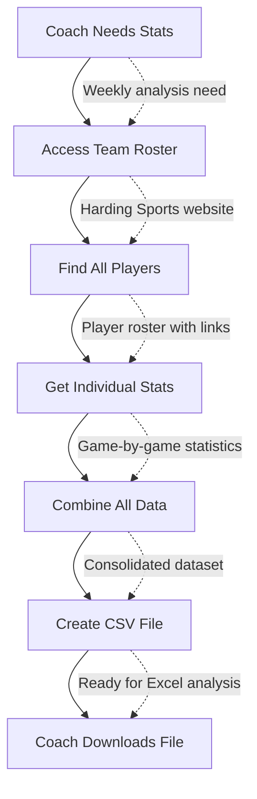

# Harding Soccer Stats Scraper - Workflow Specification

---

## 1. Overview

### Purpose & Description
* **What it does**: Automatically extracts all Harding University soccer player statistics from the athletics website and delivers them in a single, analysis-ready CSV file
* **Process**: Visits the team roster page, identifies all players, downloads their individual statistics pages, and consolidates game-by-game data into structured format
* **Deliverable**: Excel-compatible CSV file with comprehensive player performance data

### Benefits & Value
* **Primary benefit**: Transforms 2-3 hours of manual data collection into a 3-minute automated process
* **Time savings**: 95% reduction in data collection time (3 hours → 3 minutes)
* **Quality improvement**: Eliminates copy-paste errors and ensures consistent data format
* **Ease of use**: One-click execution requiring no technical knowledge

### Audience
* **Primary users**: Soccer coaching staff who need regular performance data
* **Secondary users**: Athletic department administrators and student researchers
* **Stakeholders**: Athletic director, sports information office, team analysts

---

## 2. Problem & Automated Solution

### Problem Statement
Soccer coaching staff currently spend 2-3 hours manually visiting individual player pages on the Harding Sports website, copying statistics into spreadsheets, and formatting data for analysis. This process is complicated by the fact that goalkeepers have two different statistical tables (field player stats and goalkeeper-specific stats) while field players have only one table. This happens weekly during the season and monthly during off-season.

**Specific pain points:**
* Manual process consumes 6-9 hours per month of valuable coaching time
* Copy-paste errors lead to inaccurate statistics affecting coaching decisions
* Inconsistent data formatting requires additional cleanup before analysis
* Time pressure during busy season delays critical performance reviews
* Difficult to maintain historical data and track performance trends

### Solution Overview
Automated web scraping workflow that replicates the manual process but executes in minutes instead of hours. The system navigates the website like a human would, but processes all players simultaneously and ensures perfect data consistency.

**Direct benefits:**
* Reclaims 6-9 hours monthly for strategic coaching activities instead of data entry
* Guarantees 100% accuracy by eliminating human copy-paste errors
* Delivers standardized CSV format that imports directly into Excel and analytics tools
* Enables weekly data reviews instead of monthly due to reduced time commitment
* Creates foundation for advanced analytics and historical trend analysis

### Impact
* **Time reduction**: 2-3 hours → 3 minutes (95% reduction)
* **Accuracy improvement**: Zero transcription errors vs. multiple errors per session
* **Frequency increase**: Weekly reviews possible vs. monthly due to time constraints
* **Resource savings**: $200-300 worth of coaching time saved per month

---

## 3. User Experience

### Typical Usage Scenario
Coach Martinez is preparing for Monday's team meeting and needs current statistics for all players to review weekend performance and plan the week's training focus. It's Sunday evening, and the latest games have been updated on the Harding Sports website. He opens n8n in his web browser, navigates to the "Soccer Stats Scraper" workflow, and clicks the "Execute Workflow" button. Within 3 minutes, he receives a notification that the process is complete. He downloads the "harding_msoc_2024_stats.csv" file, which contains complete game-by-game statistics for all 25 players on the roster. He imports this directly into his Excel template, creates performance charts, and has actionable insights ready for tomorrow's 7 AM team meeting.

### Step-by-Step Execution
1. **Open n8n interface** → *Workflow dashboard loads* → Clean, familiar interface with workflow list
2. **Click "Soccer Stats Scraper" workflow** → *Workflow details open* → See execution history and current status
3. **Click "Execute Workflow" button** → *Process begins automatically* → No configuration needed, system handles everything
4. **Monitor progress (optional)** → *Real-time status updates* → Can see which players are being processed
5. **Download CSV file when complete** → *File ready for immediate use* → Perfect formatting for Excel import

### Alternative Usage Scenarios
* **Season-end analysis**: Athletic department runs comprehensive statistics for annual reports and NCAA submissions
* **Recruitment analysis**: Coaching staff evaluates current player performance monthly during recruiting periods to inform scholarship decisions
* **Error handling**: If website is temporarily unavailable, system provides clear error messages and processes available data, allowing manual completion of missing players

---

## 4. Technical Workflow

### High-Level Visual Diagram


### Detailed Technical Breakdown
| Node Name | Action | Input | Output | Error Impact |
|-----------|--------|-------|--------|--------------|
| Manual Trigger | User initiates workflow | Button click | Workflow start signal | No execution possible |
| Fetch Roster | Download team roster page | https://static.hardingsports.com/custompages/msoc/2024/teamgbg.htm | HTML roster content with player links | Complete workflow failure |
| Extract Player Links | Find individual player page URLs | HTML content | Array of links like "plyr_1.htm", "plyr_21.htm" | No players identified |
| Parse Roster Data | Convert links to structured player info | Player links/HTML | Player objects with jersey numbers, positions, and full URLs | Incomplete player identification |
| Fetch Player Pages | Download individual statistics pages | URLs like plyr_{number}.htm | HTML stats content (1-2 tables per player) | Missing data for affected players |
| Extract Player Stats | Convert HTML to text for parsing | HTML stats pages | Plain text statistics tables (1 or 2 tables depending on player type) | Cannot parse affected players |
| Parse Player Stats | Structure game data into records | Text statistics (field stats + goalkeeper stats for goalies) | JSON game records with appropriate statistical fields | Unusable data format |
| Create CSV File | Generate downloadable file | Structured records | harding_msoc_2024_stats.csv | No deliverable for users |

---

## 5. Data Specification

### Input Data
* **Source**: Harding Sports website (static.hardingsports.com)
* **Team roster page**: https://static.hardingsports.com/custompages/msoc/2024/teamgbg.htm
* **Individual player pages**: https://static.hardingsports.com/custompages/msoc/2024/plyr_{number}.htm
  * Example: https://static.hardingsports.com/custompages/msoc/2024/plyr_1.htm (Player #1)
  * Example: https://static.hardingsports.com/custompages/msoc/2024/plyr_21.htm (Player #21)
* **Format**: HTML pages with embedded statistics tables (1 table for field players, 2 tables for goalkeepers)
* **Requirements**: Active internet connection and accessible website
* **Data Complexity**: Goalkeepers have both field player statistics and goalkeeper-specific statistics requiring dual table parsing

### Output Data Schema

**Field Player Statistics (Single Table)**
| Field | Type | Description | Example |
|-------|------|-------------|---------|
| jersey | String | Player's jersey number | "21" |
| name | String | Player's full name | "Aitor Scholl" |
| date | String | Game date (MM/DD/YY format) | "09/05/24" |
| opponent | String | Opposing team name | "Oklahoma Baptist" |
| score | String | Final game score | "2-1" |
| gp | String | Games played | "1" |
| gs | String | Games started | "0" |
| minutes | String | Minutes played | "25" |
| goals | String | Goals scored | "0" |
| assists | String | Assists | "0" |
| shots | String | Total shots | "2" |
| sog | String | Shots on goal | "1" |
| fouls | String | Fouls committed | "1" |
| yellow | String | Yellow cards | "0" |
| red | String | Red cards | "0" |

**Goalkeeper Statistics (Dual Tables - Field Stats + Goalkeeper Stats)**
| Field | Type | Description | Example |
|-------|------|-------------|---------|
| jersey | String | Player's jersey number | "1" |
| name | String | Player's full name | "Inigo Chavarria" |
| date | String | Game date (MM/DD/YY format) | "09/05/24" |
| opponent | String | Opposing team name | "Oklahoma Baptist" |
| score | String | Final game score | "2-1" |
| gp | String | Games played | "1" |
| gs | String | Games started | "1" |
| minutes | String | Minutes played | "90" |
| goals | String | Goals scored (field stats) | "0" |
| assists | String | Assists (field stats) | "0" |
| shots | String | Total shots (field stats) | "0" |
| sog | String | Shots on goal (field stats) | "0" |
| fouls | String | Fouls committed (field stats) | "0" |
| yellow | String | Yellow cards (field stats) | "0" |
| red | String | Red cards (field stats) | "0" |
| ga | String | Goals against (goalkeeper stats) | "1" |
| gaaVg | String | Goals against average | "1.00" |
| saves | String | Number of saves | "5" |
| savePct | String | Save percentage | "83.3" |
| w | String | Wins | "1" |
| l | String | Losses | "0" |
| t | String | Ties | "0" |
| sho | String | Shutouts | "0" |

### Sample Output

**Field Player Records**
```
jersey,name,date,opponent,score,gp,gs,minutes,goals,assists,shots,sog,fouls,yellow,red
21,Aitor Scholl,09/05/24,Oklahoma Baptist,2-1,1,0,25,0,0,2,1,1,0,0
21,Aitor Scholl,09/07/24,Arkansas Tech,1-0,1,1,90,1,1,4,2,0,0,0
```

**Goalkeeper Records (Combined Field + Goalkeeper Stats)**
```
jersey,name,date,opponent,score,gp,gs,minutes,goals,assists,shots,sog,fouls,yellow,red,ga,gaaVg,saves,savePct,w,l,t,sho
1,Inigo Chavarria,09/05/24,Oklahoma Baptist,2-1,1,1,90,0,0,0,0,0,0,0,1,1.00,5,83.3,1,0,0,0
1,Inigo Chavarria,09/07/24,Arkansas Tech,1-0,1,1,90,0,0,0,0,0,0,0,0,0.50,3,100.0,1,0,0,1
```

---

## 6. Success Criteria & Quality Assurance

### Success Metrics
**Functional criteria:**
* Workflow completes within 5 minutes regardless of roster size
* All active players from roster page are processed and included
* CSV contains all available statistical categories with proper headers
* Zero manual intervention required for standard execution

**User experience criteria:**
* One-click execution for non-technical coaching staff
* Clear progress indication and meaningful error messages
* File ready for immediate Excel import without formatting issues
* Intuitive download process through n8n interface

**Business criteria:**
* 95% time reduction compared to manual process (3 hours → 3 minutes)
* 100% accuracy compared to manual data collection
* Enables weekly statistical reviews instead of monthly
* All coaching staff can execute without technical training

### Validation & Quality Checks
* **Data quality**: Verify jersey numbers and player names match official roster, validate date formats are consistent, confirm goalkeepers have both field and goalkeeper statistics
* **Process integrity**: Confirm roster page accessed successfully, all player links functional, dual table parsing works for goalkeepers, CSV properly formatted
* **Output validation**: Check file size is reasonable (50-500KB), contains expected number of records based on roster size, goalkeepers have additional statistical columns

---

## 7. Setup & Configuration

### Prerequisites
**Access requirements:**
* Internet connectivity to access Harding Sports website
* Access to n8n instance (cloud or self-hosted)
* Web browser for n8n interface access

**Technical setup:**
* n8n instance running version 1.x or higher
* Sufficient storage space for CSV output files (minimal - under 1MB per file)
* No special credentials required (public website data)

**Knowledge requirements:**
* Basic understanding of soccer statistics terminology
* Familiarity with CSV file handling and Excel import
* No coding or technical expertise required

### Configuration Steps
1. **Import workflow**: Upload soccer.json file through n8n import feature under "Workflows" menu
2. **Verify website access**: 
   * Test that https://static.hardingsports.com/custompages/msoc/2024/teamgbg.htm loads from n8n instance
   * Check that individual player pages are accessible (e.g., plyr_1.htm, plyr_21.htm)
3. **Run test execution**: Execute workflow once with current roster to validate functionality
4. **Confirm file download**: Ensure CSV file generates properly and can be downloaded

**Note**: The workflow is pre-configured with 2024 URLs. For different seasons, the year in URLs must be updated in the workflow configuration.

---

## 8. Operations & Troubleshooting

### Usage Instructions
**Manual execution:**
1. Open web browser and navigate to n8n interface
2. Select "Soccer Stats Scraper" from workflow list
3. Click "Execute Workflow" button in the top right
4. Monitor execution progress in the log panel (optional)
5. Download generated CSV file when "success" status appears

**Best practices:**
* Run during off-peak hours (evenings/weekends) to minimize website load
* Execute weekly during active season for fresh data
* Validate file contents before using for critical analysis
* Keep previous versions for historical comparison and backup

### Troubleshooting
| Issue | Likely Cause | Action |
|-------|--------------|--------|
| No players found in output | Website structure changed or roster page unavailable | 1. Check if https://static.hardingsports.com/custompages/msoc/2024/teamgbg.htm loads in browser<br>2. Contact technical administrator to update workflow |
| Some players missing from results | Individual player pages temporarily unavailable | 1. Check specific player URLs (e.g., plyr_1.htm, plyr_21.htm)<br>2. Re-run workflow later, manually note missing players |
| Goalkeeper statistics incomplete | Parsing logic failed to extract both statistical tables | 1. Verify goalkeeper pages have both field and goalkeeper tables<br>2. Contact technical administrator for parsing logic review |
| Field players showing goalkeeper columns | Data parsing incorrectly identified player type | 1. Check roster page for accurate position information<br>2. Manual review of affected player pages needed |
| Execution takes longer than 10 minutes | Large roster size or slow website response | Wait for completion, consider running during off-peak hours |
| CSV file won't open in Excel | File download interrupted or corrupted | Re-run workflow to generate fresh file |
| Workflow shows "failed" status | Network connectivity issues or website down | 1. Check internet connection<br>2. Verify Harding Sports website is accessible<br>3. Try again in 30 minutes |

**Success indicators:**
* All workflow nodes show green checkmarks in execution log
* CSV file is generated and available for download
* File size is reasonable (typically 50-500KB depending on roster size)
* File opens properly in Excel with expected columns and data

**Failure indicators:**
* Red error indicators on any workflow nodes
* No CSV file generated or zero-byte file
* Error messages mentioning network connectivity or parsing issues
* Execution time exceeds 15 minutes without completion

---

## 9. Maintenance & Enhancements

### Routine Maintenance
**Weekly (during active season):**
* Verify workflow executes successfully with current roster
* Check for new players added to team roster
* Validate output data quality and completeness
* Confirm goalkeeper statistics include both field and goalkeeper-specific data

**Seasonal:**
* Update year in URLs for new season:
  * Team roster: https://static.hardingsports.com/custompages/msoc/{YEAR}/teamgbg.htm
  * Player pages: https://static.hardingsports.com/custompages/msoc/{YEAR}/plyr_{number}.htm
  * Example: Change 2024 → 2025 for next season
* Verify roster page structure hasn't changed on website
* Test workflow with new season's player pages and data format
* Update CSV filename to reflect new year (e.g., harding_msoc_2025_stats.csv)

**Ad-hoc:**
* **Trigger**: Website structure changes causing workflow failures
* **Process**: Technical administrator updates CSS selectors and parsing logic, tests with current data, deploys updated workflow

### Future Enhancements
**Short-term (next 3 months):**
* Email notification system when workflow completes
* Error summary report for failed player pages
* Basic data validation checks and anomaly detection

**Long-term (6+ months):**
* Extension to other sports (basketball, baseball, volleyball)
* Historical data comparison and trend analysis features
* Integration with coaching analytics dashboard
* Automated scheduling for regular execution during season

---

## 10. Stakeholders & Resources

### Stakeholders
* **Business owner**: Soccer Coaching Staff (Head Coach, Assistant Coaches) - Define requirements and use output for strategic decisions
* **Technical owner**: Ed Insights Team - Develop, maintain, and enhance workflow functionality
* **Primary users**: Coaching staff who execute workflow weekly and use data for performance analysis
* **Support contact**: Ed Insights Team for technical issues, Athletic Department IT for access issues

### Documentation & Support Links
**User resources:**
* Excel analysis templates for imported soccer statistics
* Soccer statistics terminology reference guide
* n8n basic user guide for non-technical users

**Technical resources:**
* Harding Sports website URL patterns:
  * Team roster: https://static.hardingsports.com/custompages/msoc/{YEAR}/teamgbg.htm
  * Player pages: https://static.hardingsports.com/custompages/msoc/{YEAR}/plyr_{NUMBER}.htm
* n8n workflow development and maintenance guide
* Web scraping best practices and troubleshooting

**Business context:**
* Soccer program performance evaluation criteria and KPIs
* NCAA statistics reporting requirements and formats
* Athletic department data governance and privacy policies

---

## Quick Reference Summary

**What**: Automatically extracts all Harding soccer player statistics into Excel-ready CSV file

**Why**: Saves 2-3 hours of manual data collection per session, eliminates errors, enables weekly analysis

**Who**: Soccer coaching staff use weekly during season, monthly during off-season

**How**: One-click execution in n8n - no technical knowledge required

**Output**: "harding_msoc_2024_stats.csv" with complete game-by-game player statistics

**Time**: 2-5 minutes execution, ready for immediate Excel import

**Support**: Contact Ed Insights Team for technical issues or enhancement requests

---

## Impact Statement

This workflow represents a 95% efficiency gain in sports data collection, transforming hours of manual work into minutes of automated processing. It enables the coaching staff to focus on what they do best - developing players and winning games - instead of copying and pasting statistics. The consistent, error-free data format also opens opportunities for advanced analytics and performance insights that were previously impractical due to time constraints.