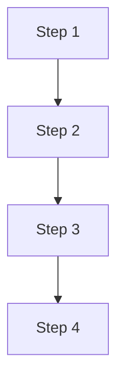

# n8n Workflow Specification Template v3.0

## Human-Readable Documentation Format

This template prioritizes readability and practical usage over machine-readable YAML blocks.

---

## 1. Overview

### Purpose & Description
* **What it does**: [Clear statement of workflow purpose]
* **Process**: [Brief description of automated process]
* **Deliverable**: [What users get at the end]

### Benefits & Value
* **Primary benefit**: [Core value proposition]
* **Time savings**: [Specific time reduction]
* **Quality improvement**: [Accuracy/consistency gains]
* **Ease of use**: [User experience benefits]

### Audience
* **Primary users**: [Who uses this daily/weekly]
* **Secondary users**: [Who benefits indirectly]
* **Stakeholders**: [Who needs to know about it]

---

## 2. Problem & Automated Solution

### Problem Statement
[Brief description of current manual process and why it's problematic]

**Specific pain points:**
* [Pain point 1 with impact]
* [Pain point 2 with impact]
* [Pain point 3 with impact]

### Solution Overview
[High-level automation approach and how it addresses the pain points]

**Direct benefits:**
* [Benefit 1 addressing pain point 1]
* [Benefit 2 addressing pain point 2]
* [Benefit 3 addressing pain point 3]

### Impact
* **Time reduction**: [Before vs after]
* **Accuracy improvement**: [Error reduction]
* **Frequency increase**: [How often can now be done]
* **Resource savings**: [Staff time/cost savings]

---

## 3. User Experience

### Typical Usage Scenario
[Detailed narrative scenario showing complete user journey from need to outcome]

### Step-by-Step Execution
1. **[User action]** → *[System response]* → [User benefit]
2. **[User action]** → *[System response]* → [User benefit]
3. **[User action]** → *[System response]* → [User benefit]
4. **[User action]** → *[System response]* → [User benefit]

### Alternative Usage Scenarios
* **[Scenario name]**: [Brief description and frequency]
* **[Scenario name]**: [Brief description and frequency]
* **Error handling**: [What users experience when things go wrong]

---

## 4. Technical Workflow

### High-Level Visual Diagram


### Detailed Technical Breakdown
| Node Name | Action | Input | Output | Error Impact |
|-----------|--------|-------|--------|--------------|
| [Node 1] | [What it does] | [What it needs] | [What it produces] | [What happens if it fails] |
| [Node 2] | [What it does] | [What it needs] | [What it produces] | [What happens if it fails] |
| [Node 3] | [What it does] | [What it needs] | [What it produces] | [What happens if it fails] |

---

## 5. Data Specification

### Input Data
* **Source**: [Where data comes from]
* **Format**: [Data format/structure]
* **Requirements**: [What must be present for workflow to work]

### Output Data Schema
| Field | Type | Description | Example |
|-------|------|-------------|---------|
| [field1] | [String/Number] | [What this field contains] | [Sample value] |
| [field2] | [String/Number] | [What this field contains] | [Sample value] |
| [field3] | [String/Number] | [What this field contains] | [Sample value] |

### Sample Output
```
[Show actual sample of output format - CSV rows, JSON structure, etc.]
```

---

## 6. Success Criteria & Quality Assurance

### Success Metrics
**Functional criteria:**
* [Specific measurable outcome 1]
* [Specific measurable outcome 2]
* [Specific measurable outcome 3]

**User experience criteria:**
* [User satisfaction measure 1]
* [User satisfaction measure 2]
* [User satisfaction measure 3]

**Business criteria:**
* [Business impact measure 1]
* [Business impact measure 2]
* [Business impact measure 3]

### Validation & Quality Checks
* **Data quality**: [What gets checked]
* **Process integrity**: [How completeness is verified]
* **Output validation**: [How results are confirmed correct]

---

## 7. Setup & Configuration

### Prerequisites
**Access requirements:**
* [Requirement 1]
* [Requirement 2]
* [Requirement 3]

**Technical setup:**
* [Technical requirement 1]
* [Technical requirement 2]
* [Technical requirement 3]

**Knowledge requirements:**
* [Knowledge requirement 1]
* [Knowledge requirement 2]

### Configuration Steps
1. [Clear setup step with specific actions]
2. [Clear setup step with specific actions]
3. [Clear setup step with specific actions]
4. [Validation step to confirm setup works]

---

## 8. Operations & Troubleshooting

### Usage Instructions
**Manual execution:**
1. [Step with specific UI actions]
2. [Step with specific UI actions]
3. [Step with specific UI actions]
4. [Step with specific UI actions]

**Best practices:**
* [Recommendation 1]
* [Recommendation 2]
* [Recommendation 3]

### Troubleshooting
| Issue | Likely Cause | Action |
|-------|--------------|--------|
| [Common problem 1] | [Why it happens] | [What user should do] |
| [Common problem 2] | [Why it happens] | [What user should do] |
| [Common problem 3] | [Why it happens] | [What user should do] |

**Success indicators:**
* [Sign of successful execution 1]
* [Sign of successful execution 2]
* [Sign of successful execution 3]

**Failure indicators:**
* [Sign something went wrong 1]
* [Sign something went wrong 2]
* [Sign something went wrong 3]

---

## 9. Maintenance & Enhancements

### Routine Maintenance
**Weekly:**
* [Weekly maintenance task 1]
* [Weekly maintenance task 2]

**Monthly/Seasonal:**
* [Periodic maintenance task 1]
* [Periodic maintenance task 2]

**Ad-hoc:**
* **Trigger**: [When updates are needed]
* **Process**: [How updates are implemented]

### Future Enhancements
**Short-term (next 3 months):**
* [Enhancement 1]
* [Enhancement 2]
* [Enhancement 3]

**Long-term (6+ months):**
* [Major enhancement 1]
* [Major enhancement 2]
* [Integration opportunity]

---

## 10. Stakeholders & Resources

### Stakeholders
* **Business owner**: [Name/Role] - [Responsibilities]
* **Technical owner**: [Name/Role] - [Responsibilities]
* **Primary users**: [Roles and how they use it]
* **Support contact**: [Who to contact for help]

### Documentation & Support Links
**User resources:**
* [Link to user guide]
* [Link to training materials]
* [Link to FAQ]

**Technical resources:**
* [Link to technical documentation]
* [Link to API docs]
* [Link to system documentation]

**Business context:**
* [Link to business requirements]
* [Link to process documentation]
* [Link to compliance requirements]

---

## Quick Reference Summary

**What**: [One sentence describing what this does]

**Why**: [One sentence describing the business value]

**Who**: [Who uses it and how often]

**How**: [One sentence describing how to execute it]

**Output**: [What users get]

**Time**: [How long it takes]

**Support**: [Who to contact for help]

---

## Usage Notes

### This Template Works Best When:
* You start with business context before technical details
* You use tables for structured information instead of YAML blocks
* You write in plain language that non-technical users can understand
* You focus on practical, actionable information
* You include real examples and specific details

### Avoid:
* Heavy use of YAML code blocks for information humans need to read
* Technical jargon without explanation
* Verbose descriptions where bullet points would work better
* Abstract concepts without concrete examples
* Missing the "why" behind technical decisions