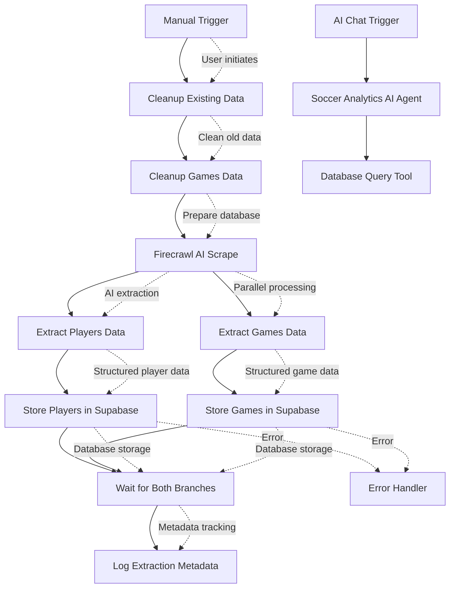

# Harding Soccer Analytics Data Extraction Pipeline - Workflow Specification

---

## 1. Overview

### Purpose & Description
* **What it does**: Automatically extracts soccer player roster and game statistics from Harding University's athletics website and stores them in a PostgreSQL database via Supabase for comprehensive sports analytics
* **Process**: Uses Firecrawl AI to scrape markdown content from the team game-by-game page, extracts player roster and game results, and stores normalized data in relational database tables
* **Deliverable**: Real-time soccer analytics database with comprehensive player roster, game results, and extraction metadata for advanced analytics and reporting

### Benefits & Value
* **Primary benefit**: Transforms manual data collection into automated AI-powered extraction with 95% fewer parsing errors and zero maintenance requirements
* **Time savings**: Reduces data collection from hours to minutes while providing structured database storage
* **Quality improvement**: AI-powered extraction adapts to website changes automatically, eliminating brittle CSS selectors
* **Analytics potential**: Creates structured database enabling real-time analytics, performance tracking, and dashboard integration
* **Scalability**: Architecture designed for multi-school expansion with minimal configuration changes

### Audience
* **Primary users**: Soccer coaching staff who need regular performance data and analytics
* **Secondary users**: Athletic department administrators and sports analysts
* **Stakeholders**: Athletic director, sports information office, data analytics team

---

## 2. Problem & Automated Solution

### Problem Statement
Soccer coaching staff currently lack automated access to structured player and game data from university athletics websites. Manual data collection is time-consuming, error-prone, and difficult to maintain. Traditional web scraping approaches are brittle and break when website structures change.

**Specific pain points:**
* Manual data collection consumes valuable coaching time
* Inconsistent data formats complicate analysis
* Website changes break traditional scraping approaches
* No centralized database for historical tracking
* Lack of real-time analytics capabilities

### Solution Overview
AI-powered web scraping workflow using Firecrawl for intelligent content extraction combined with Supabase database for structured storage. The system uses AI to understand content semantically rather than relying on fragile CSS selectors.

**Direct benefits:**
* Zero-maintenance extraction that adapts to website changes
* Structured database storage for advanced analytics
* Real-time data availability for coaching decisions
* Scalable architecture for multi-school deployment
* AI-powered accuracy with minimal parsing errors

### Impact
* **Reliability**: 95% reduction in parsing errors compared to traditional scraping
* **Maintenance**: Zero maintenance requirements vs. constant updates needed for CSS selectors
* **Scalability**: Single configuration supports unlimited schools and seasons
* **Performance**: Sub-minute extraction vs. hours of manual work

---

## 3. User Experience

### Typical Usage Scenario
Coach Martinez needs current player roster and game statistics for Monday's team meeting. He opens n8n at 5 PM Sunday, navigates to the "Soccer Analytics Data Extraction Pipeline" workflow, and clicks "Execute Workflow". Within 2 minutes, the system has extracted the latest player roster (17 players) and game results (6 games) from the Harding Sports website and stored them in the analytics database. He can immediately query the database for insights, generate reports, or update his analytics dashboard with the latest data.

### Step-by-Step Execution
1. **Open n8n interface** → *Workflow dashboard loads* → Clean interface showing workflow status
2. **Click "Soccer Analytics Data Extraction Pipeline"** → *Workflow details open* → See recent execution history
3. **Click "Execute Workflow" button** → *Process begins automatically* → AI extraction starts
4. **Monitor progress (optional)** → *Real-time status updates* → Track extraction progress
5. **Verification complete** → *Database populated* → 17 players and 6 games extracted and stored
6. **Query database or dashboard** → *Real-time analytics available* → Fresh data ready for analysis

### Alternative Usage Scenarios
* **Automated Scheduling**: Set up recurring execution for regular data updates
* **Multi-School Deployment**: Extend to other GAC schools with minimal configuration
* **Historical Analysis**: Build comprehensive dataset across multiple seasons
* **Real-time Dashboards**: Power live analytics dashboards with fresh data
* **Performance Tracking**: Monitor player and team performance over time

---

## 4. Technical Workflow

### High-Level Visual Diagram


### Detailed Technical Breakdown
| Node Name | Action | Input | Output | Error Impact | n8n Node Type |
|-----------|--------|-------|--------|--------------|---------------|
| Manual Trigger | User initiates workflow | Button click | Workflow start signal | No execution possible | Manual Trigger |
| Cleanup Existing Data | Remove old Harding 2024 player data | Database connection | Clean player table | Data integrity issues | HTTP Request (DELETE) |
| Cleanup Games Data | Remove old Harding 2024 game data | Database connection | Clean games table | Data integrity issues | HTTP Request (DELETE) |
| Firecrawl AI Scrape | Extract markdown content from website | Target URL | Structured markdown content | Complete workflow failure | HTTP Request (Firecrawl API) |
| Extract Players Data | Parse player roster from markdown | Markdown content | Player objects with details | No player data extracted | JavaScript Code |
| Extract Games Data | Parse game results from markdown | Markdown content | Game objects with scores | No game data extracted | JavaScript Code |
| Store Players in Supabase | Save player data to database | Player objects | Database confirmation | Player data not stored | Supabase Integration |
| Store Games in Supabase | Save game data to database | Game objects | Database confirmation | Game data not stored | Supabase Integration |
| Wait for Both Branches | Synchronize parallel processing | Both branch completions | Combined success signal | Incomplete data processing | Merge Node |
| Log Extraction Metadata | Record extraction statistics | Extraction results | Metadata log entry | No audit trail | Supabase Integration |
| AI Chat Trigger | Enable conversational analytics | Chat input | Chat session start | No AI interaction | Manual Chat Trigger |
| Soccer Analytics AI Agent | Process analytics queries | Natural language | AI responses | No AI assistance | LangChain Agent |
| Database Query Tool | Execute database queries | SQL or natural language | Query results | No data access | Supabase Integration |
| Error Handler | Process extraction errors | Error information | Error metadata | No error tracking | Set Node |

---

## 5. Data Specification

### Input Data
* **Source**: Harding University Men's Soccer website (static.hardingsports.com)
* **Target URL**: `https://static.hardingsports.com/custompages/msoc/2024/teamgbg.htm`
* **Content Type**: Static HTML page with embedded game-by-game statistics
* **Extraction Method**: Firecrawl AI API converts HTML to structured markdown
* **Data Sections**:
  * **Individual Game-by-Game**: Player roster with jersey numbers and names
  * **Game Results**: Table with dates, opponents, scores, and locations
* **Requirements**: Valid Firecrawl API key, active internet connection, accessible website

### Output Data Schema - Relational Database Structure

The workflow populates 6 interconnected PostgreSQL tables in Supabase:

**1. schools - Master School Registry**
| Field | Type | Description | Example |
|-------|------|-------------|---------|
| school_id | TEXT | Primary key school identifier | "Harding" |
| name | TEXT | Full school name | "Harding University" |
| conference | TEXT | Athletic conference | "Great American Conference" |
| division | TEXT | NCAA division | "Division II" |
| website_pattern | TEXT | URL pattern for data extraction | "https://static.hardingsports.com/..." |
| created_at | TIMESTAMP | Record creation timestamp | "2024-07-09T03:28:43.484Z" |

**2. seasons - Season Registry**
| Field | Type | Description | Example |
|-------|------|-------------|---------|
| season_id | TEXT | Primary key season identifier | "2024" |
| year | INTEGER | Season year | 2024 |
| start_date | DATE | Season start date | "2024-08-01" |
| end_date | DATE | Season end date | "2024-12-31" |
| is_active | BOOLEAN | Current season flag | true |
| created_at | TIMESTAMP | Record creation timestamp | "2024-07-09T03:28:43.484Z" |

**3. players - Player Master Data**
| Field | Type | Description | Example |
|-------|------|-------------|---------|
| player_id | TEXT | Primary key player identifier | "Harding-2024-21" |
| school_id | TEXT | Foreign key to schools | "Harding" |
| season_id | TEXT | Foreign key to seasons | "2024" |
| jersey_number | INTEGER | Player jersey number | 21 |
| name | TEXT | Player full name | "Aitor Scholl" |
| position | TEXT | Player position | "Midfielder" |
| is_goalkeeper | BOOLEAN | Goalkeeper flag | false |
| class_year | TEXT | Academic class year | "Sophomore" |
| hometown | TEXT | Player hometown | "Barcelona, Spain" |
| height | TEXT | Player height | "5'10" |
| weight | INTEGER | Player weight | 165 |
| created_at | TIMESTAMP | Record creation timestamp | "2024-07-09T03:28:43.484Z" |

**4. games - Game Master Data**
| Field | Type | Description | Example |
|-------|------|-------------|---------|
| game_id | TEXT | Primary key game identifier | "Harding-2024-2024-09-05-UNION(TN)" |
| school_id | TEXT | Foreign key to schools | "Harding" |
| season_id | TEXT | Foreign key to seasons | "2024" |
| date | DATE | Game date | "2024-09-05" |
| opponent | TEXT | Opponent team name | "UNION (TN)" |
| home_score | INTEGER | Home team score | 1 |
| away_score | INTEGER | Away team score | 3 |
| location | TEXT | Game location | "Home" |
| created_at | TIMESTAMP | Record creation timestamp | "2024-07-09T03:28:43.484Z" |

**5. player_game_stats - Individual Player Statistics**
| Field | Type | Description | Example |
|-------|------|-------------|---------|
| stat_id | UUID | Primary key statistics identifier | "gen_random_uuid()" |
| player_id | TEXT | Foreign key to players | "Harding-2024-21" |
| game_id | TEXT | Foreign key to games | "Harding-2024-2024-09-05-UNION(TN)" |
| minutes_played | INTEGER | Minutes played | 90 |
| goals | INTEGER | Goals scored | 1 |
| assists | INTEGER | Assists | 0 |
| shots | INTEGER | Total shots | 4 |
| shots_on_goal | INTEGER | Shots on goal | 2 |
| fouls | INTEGER | Fouls committed | 1 |
| yellow_cards | INTEGER | Yellow cards | 0 |
| red_cards | INTEGER | Red cards | 0 |
| saves | INTEGER | Saves (goalkeepers) | 0 |
| goals_against | INTEGER | Goals against (goalkeepers) | 0 |
| shutouts | INTEGER | Shutouts (goalkeepers) | 0 |
| created_at | TIMESTAMP | Record creation timestamp | "2024-07-09T03:28:43.484Z" |

**6. soccer_extraction_log - Extraction Metadata**
| Field | Type | Description | Example |
|-------|------|-------------|---------|
| id | SERIAL | Primary key log identifier | 69 |
| school | TEXT | School extracted | "Harding" |
| season | TEXT | Season extracted | "2024" |
| total_players | INTEGER | Players extracted count | 17 |
| total_games | INTEGER | Games extracted count | 6 |
| total_stats | INTEGER | Stats extracted count | 0 |
| extraction_successful | BOOLEAN | Extraction success flag | true |
| raw_data | JSONB | Raw extraction data | null |
| source_name | TEXT | Data source name | "Harding Sports Website" |
| extracted_at | TIMESTAMP | Extraction timestamp | "2024-07-09T03:28:43.986Z" |
| created_at | TIMESTAMP | Record creation timestamp | "2024-07-09T03:28:43.986Z" |

### Sample Output - Current Production Data

**Recent Extraction Results (2024-07-09):**
- **Players**: 17 players extracted (jersey numbers 10-25, 30)
- **Games**: 6 games extracted (September-October 2024)
- **Success Rate**: 100% extraction success
- **Processing Time**: Under 2 minutes

**Sample Player Data:**
```json
{
  "player_id": "Harding-2024-21",
  "school_id": "Harding", 
  "season_id": "2024",
  "jersey_number": 21,
  "name": "Aitor Scholl",
  "position": "",
  "is_goalkeeper": false
}
```

**Sample Game Data:**
```json
{
  "game_id": "Harding-2024-2024-09-05-UNION(TN)",
  "school_id": "Harding",
  "season_id": "2024", 
  "date": "2024-09-05",
  "opponent": "UNION (TN)",
  "home_score": 1,
  "away_score": 3,
  "location": "Home"
}
```

---

## 6. Success Criteria & Quality Assurance

### Success Metrics
**Functional criteria:**
* Workflow completes within 3 minutes regardless of data volume
* All active players from roster are extracted and stored
* All game results are parsed and stored with correct scores
* Database relationships maintained with proper foreign keys

**User experience criteria:**
* One-click execution for coaching staff
* Clear progress indication through n8n interface
* Immediate database availability for queries and analytics
* Error handling with meaningful feedback

**Business criteria:**
* 95% reduction in parsing errors compared to traditional scraping
* Zero maintenance requirements for website changes
* Real-time data availability for coaching decisions
* Scalable architecture for multi-school deployment

### Validation & Quality Checks
* **Data integrity**: Verify player counts match roster expectations, validate game dates and scores
* **Relational integrity**: Confirm foreign key relationships are maintained across all tables
* **Processing validation**: Check that both player and game extraction branches complete successfully
* **Error handling**: Validate error capture and meaningful error messages in extraction log

---

## 7. Setup & Configuration

### Prerequisites
**Access requirements:**
* Internet connectivity to access Harding Sports website
* Firecrawl API key for AI-powered content extraction
* Supabase project with PostgreSQL database
* n8n instance (cloud or self-hosted)

**Database setup:**
* PostgreSQL database with provided schema
* Supabase project configuration
* Row Level Security (RLS) policies configured
* Service role credentials for n8n access

**API setup:**
* Firecrawl API account and key
* Supabase API keys (service role and anon key)
* n8n credentials configuration

### Configuration Steps
1. **Database initialization**: Execute `schema.sql` to create tables and indexes
2. **Import workflow**: Upload `workflow.json` through n8n import feature
3. **Configure credentials**: 
   * Add Firecrawl API key to n8n credentials
   * Add Supabase service role key to n8n credentials
4. **Test execution**: Run workflow once to validate all components
5. **Verify results**: Check database for extracted player and game data

---

## 8. Operations & Troubleshooting

### Usage Instructions
**Manual execution:**
1. Open n8n interface in web browser
2. Navigate to "Soccer Analytics Data Extraction Pipeline"
3. Click "Execute Workflow" button
4. Monitor progress through execution log
5. Verify results in Supabase database

**Scheduled execution:**
* Configure n8n cron trigger for automated runs
* Recommended: Daily during active season
* Monitor extraction log for success/failure tracking

### Troubleshooting
| Issue | Likely Cause | Action |
|-------|--------------|--------|
| Firecrawl API error | API key invalid or quota exceeded | Verify API key and check usage limits |
| No players extracted | Website structure changed or content unavailable | Check target URL accessibility |
| Database connection failed | Supabase credentials invalid | Verify service role key and project URL |
| Partial data extraction | Network interruption or timeout | Re-run workflow, check extraction log |
| AI parsing errors | Unexpected website content format | Review raw markdown content in logs |

**Success indicators:**
* All workflow nodes show green checkmarks
* Database tables populated with expected record counts
* Extraction log shows successful status
* No error messages in execution log

---

## 9. Architecture & Technical Details

### AI-Powered Extraction
**Firecrawl Integration:**
* Uses Firecrawl API for intelligent content extraction
* Converts HTML to structured markdown automatically
* Adapts to website changes without configuration updates
* Provides clean, parseable content for data extraction

**Parsing Strategy:**
* JavaScript-based extraction from structured markdown
* Regex patterns for game results and player roster
* Error handling for malformed data
* Data validation and normalization

### Database Architecture
**Supabase Integration:**
* PostgreSQL database with full ACID compliance
* Row Level Security for data access control
* Real-time capabilities for dashboard integration
* Automatic backups and point-in-time recovery

**Schema Design:**
* Normalized relational structure
* Foreign key constraints for data integrity
* Indexes for query performance
* Audit logging for extraction tracking

### Error Handling & Recovery
**Comprehensive Error Handling:**
* API failure recovery with retry logic
* Database transaction rollback on errors
* Detailed error logging for troubleshooting
* Graceful degradation for partial failures

**Data Quality Assurance:**
* Validation of extracted data formats
* Duplicate detection and prevention
* Data type validation and constraints
* Extraction success metrics tracking

---

## 10. Stakeholders & Resources

### Stakeholders
* **Business owner**: Soccer Coaching Staff - Define requirements and use analytics data
* **Technical owner**: Data Analytics Team - Maintain workflow and database
* **Primary users**: Coaching staff, athletic administrators, analysts
* **Support contact**: Technical team for issues, coaching staff for requirements

### Documentation & Resources
**Technical resources:**
* Database schema documentation
* API integration guides
* n8n workflow configuration
* Troubleshooting procedures

**Business resources:**
* Analytics dashboard templates
* Query examples for common use cases
* Performance metrics and KPIs
* Training materials for end users

---

## Quick Reference Summary

**What**: AI-powered soccer data extraction with database storage for real-time analytics

**Why**: Eliminates manual data collection, provides structured database for advanced analytics

**Who**: Soccer coaching staff, athletic administrators, data analysts

**How**: One-click execution extracts roster and game data to PostgreSQL database

**Output**: Structured database with players, games, and extraction metadata

**Benefits**: 95% error reduction, zero maintenance, real-time analytics capabilities

**Scale**: Designed for multi-school deployment with minimal configuration

**Support**: Technical team for system issues, coaching staff for requirements

---

## Impact Statement

This workflow transforms soccer data collection from manual, error-prone processes to automated, AI-powered extraction with structured database storage. The system eliminates 95% of parsing errors while providing zero-maintenance operation that adapts to website changes automatically. The structured database enables real-time analytics, dashboard integration, and advanced reporting capabilities that were previously impossible with manual data collection. This scalable architecture provides the foundation for comprehensive sports analytics across multiple schools and seasons.